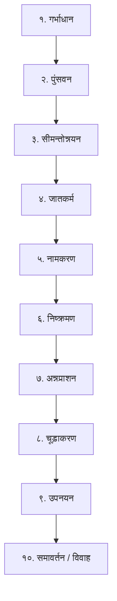
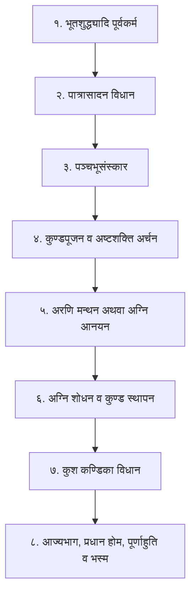

# Yagya, Havan & Homa Canonical Shastric Protocol

This skill provides the comprehensive, authoritative Shastric methodology for researching, planning, geometrically calculating, and codifying Vedic and Tantric **Yagyas (यज्ञ)**, **Havans (हवन)**, and **Homas (होम)**.

---

## 1. Classical Authorities (प्रमाण ग्रन्थ)

1. **कुण्डमार्तण्डः (Kundamartanda)** - गोविन्द दैवज्ञ विरचित (कुण्ड निर्माण, मेखला व नाभि का गणितीय प्रमाण)
2. **कुण्डसिद्धिः (Kundasiddhi)** - विठ्ठल दीक्षित कृत
3. **शारदातिलकम् (Sharada Tilakam)** - पटल ३ (कुण्ड निर्माण), पटल ४ (अग्नि संस्कार), पटल ५ (दीक्षा एवं होम)
4. **मन्त्रमहोदधिः (Mantra Mahodadhi)** - प्रथम तरङ्ग (अग्नि आधान, कुण्ड मण्डप विधान) एवं चतुर्थ तरङ्ग
5. **पारस्कर एवं आश्वलायन गृह्यसूत्र** - वैदिक गृह्यकर्म एवं श्रौत-स्मार्त होम विधान
6. **शतपथ ब्राह्मणम् एवं तैत्तिरीय संहिता** - वैश्वानर विद्या एवं अग्निचयन
7. **अग्नि पुराणम्** - कुण्ड, मण्डप, समिधा एवं हविष्य लक्षण

---

## 2. दशविध कुण्ड लक्षण एवं ज्यामितीय प्रमाण (The 10 Sacred Kundas)

शास्त्रों में यज्ञानुष्ठान के उद्देश्य और देवता के भेद से १० प्रकार के कुण्डों का विधान है (*कुण्डमार्तण्ड* एवं *शारदातिलक*):

| क्र. | कुण्ड का नाम | ज्यामितीय आकार (Geometry) | अभीष्ट फल / देवता (Deity & Purpose) | दिशा |
|:---:|:---|:---|:---|:---:|
| १ | **चतुरस्र कुण्ड (Chaturasra)** | समचतुर्भुज (Square - 1:1) | सर्वसिद्धि, शान्तिकर्म, सामान्य यज्ञ (Square for all rituals) | पूर्व / मध्य |
| २ | **योनि कुण्ड (Yoni Kunda)** | अश्वत्थ पत्र / धनुषाकार भग | सन्तान प्राप्ति, कुलवृद्धि, शाक्त साधना, भगवती आराधना | पूर्व / आग्नेय |
| ३ | **अर्धचन्द्र कुण्ड (Ardha Chandra)** | धनुष/अर्धवृत्त (Semi-circle) | शान्ति, रोगमुक्ति, चन्द्र/वरुण/सौम्य कर्म | दक्षिण |
| ४ | **त्रिकोण कुण्ड (Trikona Kunda)** | समबाहु अधोमुखी/ऊर्ध्वमुखी त्रिकोण | शत्रुशमन, स्तम्भन, उग्र देवता (काली, नृसिंह, बगलामुखी) | नैर्ऋत्य |
| ५ | **वृत्त कुण्ड (Vritta Kunda)** | पूर्ण मण्डलाकार वृत्त (Circle) | पापनाशन, जनशान्ति, मारुति एवं वायु अनुष्ठान | पश्चिम |
| ६ | **षट्कोण कुण्ड (Shatkona Kunda)** | षटार चक्र (Hexagon - 2 Triangles) | वशीकरण, आकर्षण, कार्तिकेय एवं सुदर्शन अनुष्ठान | वायव्य |
| ७ | **अष्टकोण कुण्ड (Ashtakona Kunda)** | अष्टभुज (Octagon) | आरोग्य, दीर्घायु, धन्वन्तरि, शिव एवं मृत्युंजय अनुष्ठान | उत्तर |
| ८ | **पद्म कुण्ड (Padma Kunda)** | अष्टदल कमल सदृश (Lotus shape) | महालक्ष्मी, धन-धान्य, ऐश्वर्य, श्रीविद्या, राज्यप्राप्ति | ईशान |
| ९ | **पञ्चकोण कुण्ड (Panchakona)** | पञ्चभुज (Pentagon) | भूतबाधा निवारण, विद्वेषण शमन | आग्नेय/विशेष |
| १० | **महाकुण्ड (Maha Kunda)** | चतुर्हस्त / षोडशहस्त कुण्ड | लक्षचण्डी, कोटिचण्डी, सहस्राहुति महामख | महावेदी |

### कुण्ड के अङ्ग एवं मेखला विन्यास:
प्रत्येक कुण्ड में तीन स्तर (मेखलाएं) होते हैं:
1. **प्रथमा मेखला (ऊपरी):** श्वेत वर्ण (सत्व गुण / ब्रह्मा)।
2. **द्वितीया मेखला (मध्य):** रक्त वर्ण (रजोगुण / विष्णु)।
3. **तृतीया मेखला (निचली):** कृष्ण/नील वर्ण (तमोगुण / शिव)।
- **कण्ठ:** मेखला के नीचे का स्तर।
- **नाभि:** कुण्ड के धरातल पर मध्य में स्थित उठा हुआ पद्म सदृश भाग।
- **योनि (गर्त निर्गम):** कुण्ड से पश्चिम अथवा उत्तर दिशा में जल-घृत निकासी का पवित्र मार्ग।

---

## 3. अग्नि के १० संस्कार (The Ten Agni Samskaras)

अग्नि को साधारण लौकिक अग्नि से दिव्य 'हव्यवाहन' बनाने हेतु १० शास्त्रीय संस्कार किए जाते हैं (*शारदातिलकम्* पटल ४):



1. **गर्भाधान संस्कार:** `ॐ रं गर्भाधानाय स्वाहा` - पापनाश एवं शुद्ध बीज आरोपण।
2. **पुंसवन संस्कार:** वीर्य एवं बल संवर्धन।
3. **सीमन्तोन्नयन संस्कार:** अग्नि की अमङ्गल से रक्षा।
4. **जातकर्म संस्कार:** अग्नि प्रादुर्भाव का स्वागत।
5. **नामकरण संस्कार:** अग्नि का विशिष्ट तांत्रिक/वैदिक नामकरण (उदा. वैश्वानर, जातवेदा, पिङ्गल, हव्यवाहन, शिव-अग्नि, आदि)।
6. **निष्क्रमण संस्कार:** सूर्य दर्शन एवं जगत् कल्याणार्थ उन्मीलन।
7. **अन्नप्राशन संस्कार:** प्रथम शुद्ध घृत आहुति प्रदान।
8. **चूड़ाकरण (मुण्डन):** अशुद्ध लपटों का शमन।
9. **उपनयन (यज्ञोपवीत):** अग्नि को गायत्री मन्त्र एवं ब्रह्मतेज से युक्त करना।
10. **समावर्तन / विवाह:** स्वाहा देवी के साथ अग्नि का दिव्य विवाह सम्बन्ध स्थापन।

---

## 4. अग्नि की सप्त जिह्वाएं (Seven Tongues of Agni)

*मुण्डकोपनिषद्* (१.२.४) के अनुसार अग्निदेव की सात लपटें (जिह्वाएं) हैं, जिनमें आहुति समर्पित की जाती है:
1. **काली (Krishna):** कृष्ण वर्ण, दक्षिण दिशा में - संहार एवं तान्त्रिक कर्म।
2. **कराली (Karali):** भीषण ज्वाला, नैर्ऋत्य - भय नाशक।
3. **मनोजवा (Manojava):** मन के समान तीव्र गति, पश्चिम - मनोकामना पूर्ति।
4. **सुलोहिता (Sulohita):** रक्त वर्ण, वायव्य - आकर्षण व वशीकरण।
5. **सुधूम्रवर्णा (Sudhumravarna):** धूम्र कान्ति, उत्तर - विघ्नविनाश।
6. **स्फुलिङ्गिनी (Sphulingini):** चिन्गारीयुक्त, ईशान - ऐश्वर्य एवं ज्ञान।
7. **विश्वरुची / बहुरूपा (Vishvaruchi):** सर्वव्यापक प्रकाश, मध्य - मोक्ष एवं ब्रह्मसाक्षात्कार।

---

## 5. समिधा एवं हविष्य चयन (Sacred Woods & Offerings)

### (क) नवग्रह समिधा चक्र
| ग्रह | समिधा का वृक्ष | फल / प्रभाव |
|:---:|:---|:---|
| **सूर्य** | **अर्क (मदार)** | तेज, आरोग्य एवं राजसम्मान |
| **चन्द्र** | **पलाश (ढाक)** | मनःशान्ति, सन्तान एवं मेधा |
| **मङ्गल** | **खदिर (खैर)** | शौर्य, भूमि लाभ एवं रक्त शुद्धि |
| **बुध** | **अपामार्ग (चिरचिटा)** | बुद्धि, व्यापार एवं वाक् सिद्धि |
| **गुरु** | **अश्वत्थ (पीपल)** | ज्ञान, धर्म, मोक्ष एवं गुरु कृपा |
| **शुक्र** | **औदुम्बर (गूलर)** | धन, ऐश्वर्य एवं भौतिक सुख |
| **शनि** | **शमी (खेजड़ी)** | संकट मुक्ति, न्याय एवं शनि शान्ति |
| **राहु** | **दूर्वा (दूब घास)** | वंश वृद्धि, विषहरण एवं दीर्घायु |
| **केतु** | **कुश (दर्भ)** | मोक्ष, आध्यात्मिक सिद्धि एवं सर्वशान्ति |

### (ख) हविष्य घटक (Havisya Mixture):
- शुद्ध देशी गाय का घी (गव्य घृत - सर्वप्रधान)।
- काले तिल (समस्त पाप नाशक)।
- यव (जौ - कुलवृद्धि)।
- चावल / अक्षत (अखण्ड समृद्धि)।
- पंचमेवा, खीर, गुग्गुल, मधु, शर्करा, कमल बीज, पलाश पुष्प, नागरमोथा, कपूर।

---

---

## 6. सम्पूर्ण वैदिक एवं तान्त्रिक होम क्रम (Comprehensive Master Protocol)

यज्ञ की शास्त्रीय प्रक्रिया को ८ मुख्य अनुभागों में सम्पादित किया जाता है:



---

### अनुभाग १: भूतशुद्ध्यादि पूर्वकर्म (Bhuta Shuddhi & Purvanga Rites)
1. **पवित्रीकरण एवं आचमन:**
   - तीन बार आचमन (`ॐ केशवाय नमः`, `ॐ नारायणाय नमः`, `ॐ माधवाय नमः`) एवं हस्त प्रक्षालन (`ॐ गोविन्दाय नमः`)।
   - पवित्री (कुश की अंगूठी) अनामिका अंगुली में धारण करना: `ॐ पवित्रे स्थो वैष्णव्यौ...`।
2. **प्राणायाम एवं स्वस्तिवाचन:**
   - पूरक, कुम्भक, रेचक द्वारा प्राणायाम। मङ्गलाचरण हेतु स्वस्तिवाचन (`ॐ स्वस्ति न इन्द्रो वृद्धश्रवाः...`)।
3. **संकल्प:**
   - देश, काल, सम्वत्सर, अयन, ऋतु, मास, पक्ष, तिथि, वार, नक्षत्र, गोत्र, नाम एवं अभीष्ट यज्ञानुष्ठान का शास्त्रीय संकल्प।
4. **भूतशुद्धि (Divinization of the Physical Elements):**
   - साधक के स्थूल देह के ५ तत्वों का शोधन:
     - **पृथ्वी तत्व (गुदा से जानु):** लं बीज - पीत वर्ण, चतुष्कोण।
     - **जल तत्व (जानु से नाभि):** वं बीज - श्वेत वर्ण, अर्धचन्द्राकार।
     - **अग्नि तत्व (नाभि से हृदय):** रं बीज - रक्त वर्ण, त्रिकोण (पापपुरुष दहन)।
     - **वायु तत्व (हृदय से भ्रूमध्य):** यं बीज - धूम्र वर्ण, षट्कोण (अमृत प्लावन)।
     - **आकाश तत्व (भ्रूमध्य से ब्रह्मरन्ध्र):** हं बीज - निर्मल आकाशवत् (दिव्य देह प्राकट्य)।
5. **दिग्बन्धन एवं रक्षा-विधान:**
   - अस्त्र मन्त्र (`ॐ फट्`) द्वारा १० दिशाओं में पीली सरसों/अक्षत फेंककर अनिष्ट शक्तियों का निष्कासन।

---

### अनुभाग २: पात्रासादन विधान (Patrasadana - Layout of Sacrificial Implements)
कुण्ड के उत्तर अथवा ईशान भाग में बिछे हुए कुशाओं (दर्भ) पर यज्ञ पात्रों को शास्त्रोक्त क्रम से व्यवस्थित करना:

```
┌────────────────────────────────────────────────────────┐
│              पात्रासादन क्रम (यज्ञ वेदी के उत्तर में)         │
├────────────┬────────────┬────────────┬─────────────────┤
│ प्रणीता पात्र│ प्रोक्षणी पात्र│ आज्यस्थाली  │ चरुस्थाली (हविष्य)│
├────────────┼────────────┼────────────┼─────────────────┤
│ स्रुक् (Sruk) │ स्रुवा (Sruva)│ स्फ्य (काष्ठ)│ उपवेष (धृष्टि)   │
├────────────┼────────────┼────────────┼─────────────────┤
│ इध्म (समिधा)│ बर्हि (कुश) │ प्रस्तर    │ आज्य (घृत कुम्भ) │
└────────────┴────────────┴────────────┴─────────────────┘
```
- **प्रणीता पात्र:** पवित्र जल से पूर्ण, जिसमें ब्रह्म-सम्पर्क होता है।
- **प्रोक्षणी पात्र:** आहुति द्रव्यों एवं कुण्ड पर छिड़कने हेतु जल पात्र।
- **स्रुक् (Sruk):** पलाश अथवा खदिर का १ हस्त लम्बा, अग्रभाग में हाथी के सूण्ड सदृश छिद्र वाला बड़ा काष्ठ पात्र (वसोर्धारा व पूर्णाहुति हेतु)।
- **स्रुवा (Sruva):** खादिरी काष्ठ से निर्मित चम्मच सदृश पात्र, जिससे नित्य आहुतियां दी जाती हैं।
- **स्फ्य (Sphya):** खदिर काष्ठ का बना खड्गाकार उपकरण (कुण्ड में रेखाएं खींचने हेतु)।
- **उपवेष:** अग्नि की लकड़ियों को व्यवस्थित करने का काष्ठ दण्ड।
- **इध्म:** शास्त्रोक्त २१ अथवा १५ समिधाओं का पलाश/खदिर बन्धन।

---

### अनुभाग ३: पञ्चभूसंस्कार (Pancha Bhoo Samskara - Kunda Sanctification)
कुण्ड में अग्नि स्थापन से पूर्व भूमि के ५ अनिवार्य संस्कार किए जाते हैं:

1. **१. परिसमूहन (Parisamuhana):**
   - कुशाओं के मूल से कुण्ड के भीतर पूर्व से पश्चिम और दक्षिण से उत्तर की ओर झाड़कर रज/कण साफ करना।
   - मन्त्र: `ॐ निरस्तः परावसुः`।
2. **२. उपलेपन (Upalepana):**
   - गोमय (गोबर), गोमूत्र एवं गङ्गाजल से कुण्ड के भीतर लेपन करना।
   - मन्त्र: `ॐ पञ्चगव्येन / गोमयेन कुण्डं लेपयामि`।
3. **३. उल्लेखन (Ullekhana):**
   - स्फ्य अथवा काष्ठ शलाका द्वारा कुण्ड के तल पर प्राची (पश्चिम से पूर्व) और उदीची (दक्षिण से उत्तर) ३-३ रेखाएं खींचना:
     - **प्राची रेखाएं:** १. स्वर्ण रेखा, २. विद्युल्लता, ३. ताम्र रेखा।
     - **उदीची रेखाएं:** १. सती, २. भोगवती, ३. अम्बिका।
4. **४. उद्धरण (Uddharana):**
   - अनामिका अंगुली और अंगूठे से उन रेखाओं पर एकत्रित हुई मृत्तिका/धूलि को उठाकर ईशान कोण में बाहर फेंकना।
   - मन्त्र: `ॐ अपहतोऽसुरारक्षांसि वेदिषदः`।
5. **५. अभ्युक्षण (Abhyukshana):**
   - प्रोक्षणी पात्र के शुद्ध गङ्गाजल से कुण्ड का सिञ्चन कर पवित्र करना।
   - मन्त्र: `ॐ देवस्य त्वा सवितुः प्रसवेऽश्विनोर्बाहुभ्यां पूष्णो हस्ताभ्याम्... प्रोक्षामि`।

---

### अनुभाग ४: कुण्डपूजन एवं अष्टशक्ति अर्चन (Kunda Puja & Ashta-Shakti Invocations)
अग्नि स्थापन से पूर्व कुण्ड का साक्षात् मन्दिर-पीठ के रूप में अर्चन:

1. **त्रिमेखला पूजन:**
   - **ऊपरी मेखला (श्वेत):** `ॐ ब्रह्मणे नमः`
   - **मध्य मेखला (रक्त):** `ॐ विष्णवे नमः`
   - **निचली मेखला (कृष्ण):** `ॐ शिवाय नमः`
2. **नाभि एवं योनिकुण्ड पूजन:**
   - कुण्ड की पद्म-नाभि पर: `ॐ अनन्तासनाय नमः`, `ॐ कूर्मासनाय नमः`।
3. **कुण्ड की अष्टशक्तियां (८ दिशाओं में चन्दन-पुष्प द्वारा):**
   - पूर्व: **वामायै नमः**
   - आग्नेय: **ज्येष्ठायै नमः**
   - दक्षिण: **रौद्र्यै नमः**
   - नैर्ऋत्य: **काल्यै नमः**
   - पश्चिम: **कलविकरिण्यै नमः**
   - वायव्य: **बलविकरिण्यै नमः**
   - उत्तर: **बलप्रमथिन्यै नमः**
   - ईशान: **सर्वभूतदमन्यै नमः**
   - मध्य (केन्द्र): **मनोन्मन्यै नमः**

---

### अनुभाग ५: अरणि मन्थन विधान (Arani Manthana - Friction Fire Generation)
वैदिक श्रौत-स्मार्त परम्परा में अग्नि किसी माचिस आदि से नहीं, अपितु पवित्र काष्ठ मन्थन से प्रकट की जाती है:
1. **अरणि काष्ठ:** शमी के वृक्ष के गर्भ में उत्पन्न पीपल की लकड़ी (शमीगर्भाश्वत्थ)।
   - **अधरारणि:** नीचे रखी जाने वाली काष्ठ फलक (मातृ रूपा)।
   - **उत्तरारणि (प्रमन्थ):** ऊपर मन्थन करने वाली काष्ठ शलाका (पितृ रूप)।
   - **मन्थन रज्जु (नेत्र):** मन्थन हेतु प्रयुक्त रस्सी।
2. **मन्थन विधि:**
   - अधरारणि पर प्रमन्थ स्थापित कर रज्जु द्वारा तीव्र घूर्णन (मन्थन) करना।
   - मन्त्र:
     ```sanskrit
     अग्निरसि भारत वृत्रहा पुरन्दरः ।
     उदीर्यध्वं मन्थत काष्ठमेतं जातवेदसं हव्यवाहं शरण्यम् ॥
     अयन्ते योनिर्ऋत्वियो यतो जातो अरोचथाः ।
     तं जानन्नग्न आरोहाथा नो वर्धया गिरः ॥
     ```
   - घर्षण से उत्पन्न चिनगारी को सूखी रुई / समिधा चूर्ण पर ग्रहण कर फूँककर प्रदीप्त किया जाता है।

---

### अनुभाग ६: अग्नि शोधन, क्रव्याद त्याग एवं कुण्ड स्थापन (Agni Sthapana)
चाहे अग्नि अरणि से मथित हो अथवा कांस्य पात्र में कर्पूर द्वारा प्रज्वलित की गई हो, उसका शास्त्रीय शोधन अनिवार्य है:

1. **क्रव्याद (अशुभ) अंश का त्याग:**
   - अग्नि के क्रव्याद (शवदाहक/अमङ्गल) अंश को एक काष्ठ/अंगार द्वारा निकालकर नैर्ऋत्य दिशा में फेंक दिया जाता है:
     ```sanskrit
     ॐ क्रव्यादमग्निं प्रहिणोमि दूरं यमराज्यं गच्छतु रिप्रवाहः ।
     इहैवायमितरो जातवेदा देवेभ्यो हव्यं वहतु प्रजानन् ॥
     ```
2. **हव्यवाहन अग्नि की त्रिप्रदक्षिणा:**
   - शेष शुद्ध पावक अग्नि को कांस्य पात्र में लेकर कुण्ड की तीन बार प्रदक्षिणा कराई जाती है।
3. **कुण्ड में अग्नि स्थापन मन्त्र:**
   - कुण्ड के मध्य में अग्नि को स्थापित करते हैं:
     ```sanskrit
     ॐ भूर्भुवः स्वः द्यौरिव भूम्ना पृथिवीव वरिम्णा ।
     तस्यास्ते पृथिवि देवयजनि पृष्ठेऽग्निमन्नादमन्नाद्यायादधे ॥
     ॐ वह्नये नमः सुप्रतिष्ठितो भव ॥
     ```
4. **काष्ठ प्रदीपन:** पिप्पलाद/पलाश की समिधाएं रखकर अग्नि को `ॐ चित्पिङ्गले हन हन दह दह पच पच सर्वज्ञाज्ञापय स्वाहा` से प्रज्वलित करना।

---

### अनुभाग ७: कुश कण्डिका विधान (Kusha Kandika Master Protocol)
अग्नि प्रदीप्त होने के पश्चात् आहुति आरम्भ करने के मध्य की अनिवार्य वैदिक शृङ्खला:

1. **बर्हि परिस्तरण (Kusha Paristarana):**
   - कुण्ड के चारों ओर पूर्वाग्र (पूर्व की ओर नोंक वाले) और उत्तराग्र कुशों को बिछाना:
     - पूर्व में: पूर्वाग्र कुश।
     - दक्षिण में: उत्तराग्र कुश।
     - पश्चिम में: पूर्वाग्र कुश।
     - उत्तर में: उत्तराग्र कुश।
2. **प्रणीता एवं प्रोक्षणी पात्र संस्कार:**
   - दोनों पात्रों में शुद्ध जल भरना। दो दर्भ-पवित्रों (कुश की बनी दो अंगुल लम्बी पवित्री) द्वारा जल का शोधन।
   - प्रणीता पात्र को ब्रह्म-स्थान (उत्तर) में कुशाओं पर प्रतिष्ठित करना और दुर्वा/अक्षत से आच्छादित करना।
3. **पवित्र-च्छेदन एवं आज्य संस्कार (Purification of Ghee):**
   - आज्यस्थाली में गोघृत भरकर अग्नि के उत्तर भाग में तपाना।
   - **उल्मुक प्रदक्षिणा:** जलते हुए तृण/कुश को घृत के ऊपर तीन बार घुमाना (अग्नि शोधन)।
   - **उत्पवन विधि:** दो कुश-पवित्रियों को अंगूठे व अनामिका से पकड़कर घृत में डुबोकर तीन बार ऊपर उठाना:
     `ॐ सविता त्वा पुनातु अच्छिद्रेण पवित्रेण वसोः सूर्यस्य रश्मिभिः स्वाहा ॥`
4. **स्रुक्-स्रुवा सम्मार्जन (Cleansing of Ladles):**
   - स्रुक् और स्रुवा को अग्नि में प्रतप्त करना।
   - कुशाओं के अग्रभाग से भीतरी भाग को और मूल भाग से बाह्य भाग को पोंछकर पुनः प्रोक्षणी जल से धोकर अग्नि पर तपाना।
5. **पर्युक्षण (Encircling with Water):**
   - प्रणीता जल से कुण्ड के चारों ओर जल की धारा प्रवाहित करना:
     - पूर्व में: `ॐ अदितेऽनुमन्यस्व` (हे अदिति! अनुमति दो)।
     - दक्षिण में: `ॐ अनुमतेऽनुमन्यस्व` (हे अनुमति! आज्ञा दो)।
     - पश्चिम में: `ॐ सरस्वतेऽनुमन्यस्व` (हे सरस्वती! कृपा करो)।
     - सर्वत्र परिक्रमा: `ॐ देव सवितः प्रसुव यज्ञं प्रसुव यज्ञपतिं भगाय...`।

---

### अनुभाग ८: आज्यभाग, प्रधान होम, पूर्णाहुति, वसोर्धारा एवं भस्म-धारण

1. **आज्यभाग होम (घृत की दो प्रारम्भिक आहुतियां):**
   - उत्तर भाग में: `ॐ अग्नये स्वाहा । अग्नये इदं न मम ॥`
   - दक्षिण भाग में: `ॐ सोमाय स्वाहा । सोमाय इदं न मम ॥`
2. **महाव्याहृति होम:**
   - `ॐ भूः स्वाहा । अग्नये इदं न मम ॥`
   - `ॐ भुवः स्वाहा । वायवे इदं न मम ॥`
   - `ॐ स्वः स्वाहा । सूर्याय इदं न मम ॥`
   - `ॐ भूर्भुवः स्वः स्वाहा । प्रजापतये इदं न मम ॥`
3. **प्रधान देवता एवं यन्त्र होम:**
   - यन्त्र के मूल मन्त्र द्वारा १०८, १००८ अथवा १०,००० आहुतियां (हविष्य एवं घृत द्वारा)।
4. **आवरण देवता होम:**
   - यन्त्र के प्रत्येक आवरण, दल और कोण पर प्रतिष्ठित शक्तियों के नाम से 'स्वाहा' युक्त आहुति।
5. **बलिदान (दिक्पाल व क्षेत्रपाल बलि):**
   - उड़द-दही-मिष्ठान्न मिश्रित बलि आहुति।
6. **स्विष्टकृत् होम:**
   - सम्पूर्ण होम की त्रुटियों की पूर्ति हेतु अन्तिम घृत आहुति - `ॐ अग्नये स्विष्टकृते स्वाहा`।
7. **संस्रव प्राशन एवं मार्जन:**
   - स्रुवा से गिरे घृत बिन्दुओं को जल में मिलाकर यजमान द्वारा मस्तक पर प्रोक्षण।
8. **पूर्णाहुति (The Supreme Consummation):**
   - स्रुवा पर सूखा श्रीफल, सुपारी, पान, लौंग, एवं लाल रेशमी वस्त्र बांधकर घृत से परिपूर्ण करना।
   - यजमान सपत्नीक खड़े होकर मन्त्र पाठ करते हैं:
     ```sanskrit
     पूर्णमदः पूर्णमिदं पूर्णात्पूर्णमुदच्यते ।
     पूर्णस्य पूर्णमादाय पूर्णमेवावशिष्यते ॥
     मूर्धानं दिवो अरतिं पृथिव्या वैश्वानरमृत आ जातमग्निम् ।
     कविं सम्राजमतिथिं जनानामासन्ना पात्रं जनयन्त देवाः ॥
     ॐ पूर्णाहुतिमुत्तमां जुहोति सर्वं वै पूर्णाहुतिः सर्वमेवाप्नोति स्वाहा ॥
     ```
9. **वसोर्धारा (Perpetual Ghee Stream):**
   - स्रुक्/स्रुवा से लगातार बिना टूटे कुण्ड में घृत की अखण्ड धारा प्रवाहित करना:
     `ॐ वसोः पवित्रमसि शतधारं वसोः पवित्रमसि सहस्रधारम्...`।
10. **भस्म-धारण एवं रक्षा तिलक:**
    - शीतल पवित्र भस्म को अनामिका से ग्रहण कर मन्त्र द्वारा मस्तक, कण्ठ, बाहु और हृदय पर धारण करना:
      `ॐ त्र्यायुषं जमदग्नेः कश्यपस्य त्र्यायुषम् । यद्देवेषु त्र्यायुषं तन्नो अस्तु त्र्यायुषम् ॥`
11. **आरती, क्षमा-प्रार्थना एवं विसर्जन:**
    ```sanskrit
    आवाहनं न जानामि न जानामि विसर्जनम् ।
    पूजां चैव न जानामि क्षम्यतां परमेश्वर ॥
    यत्किञ्चित् कुरुते कर्म तदस्तु तव तुष्टये ।
    अग्ने त्वं समुद्रं गच्छ स्वाहा ॥
    ```

