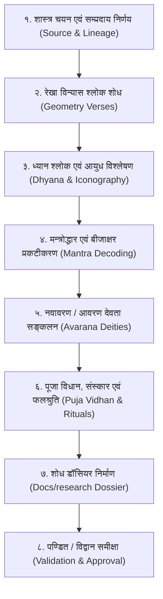

# Yantra, Tantra & Puja Vidhan Canonical Research Protocol

This skill provides the mandatory, step-by-step methodology for executing comprehensive, authentic, and hallucination-free Shastric research before designing, coding, or integrating any new **Yantra (यन्त्र)**, **Tantra (तन्त्र)**, or **Puja Vidhan (पूजा विधान)** into the system.

---

## 1. The Cardinal Rule: "Research First, Code Never Without Shastric Proof"

**Never write a single line of SVG, TypeScript, or UI code for a Yantra or ritual without a validated Research Dossier.**
Every Yantra must be anchored in classical Sanskrit scriptures with verified chapter/verse citations, exact Devanagari verses, decoded mantra-uddhara, and circuit-by-circuit (Avarana) deities.



---

## 2. Phase-by-Phase Research Methodology

### Phase 1: शास्त्रीय स्रोत चयन एवं सम्प्रदाय निर्धारण (Source Selection & Lineage Attribution)
1. **सम्प्रदाय स्पष्टता (Tradition Context):**
   - क्या यह **शाक्त (Shakta)**, **शैव (Shaiva)**, **वैष्णव (Vaishnava)**, **सौर (Saura)**, अथवा **गाणपत्य (Ganapatya)** परम्परा का है?
   - यदि श्रीविद्या या शाक्त है, तो क्या यह **कादि (Kadi - कामराज/लोपामुद्रा)**, **हादि (Hadi - लोपामुद्रा/अगस्त्य)**, अथवा **काहादि (Kahadi)** मत का है?
2. **प्रामाणिक मूल ग्रन्थों की प्राथमिकता (Hierarchy of Authorities):**
   - **सर्वोच्च प्रमाण:** श्रुति / वेद एवं उपनिषद् (ऋग्वेद, शुक्ल यजुर्वेद, नृसिंह तापनीय, त्रिपुरा उपनिषद्, आदि)।
   - **आगम एवं तन्त्र ग्रन्थ:** *श्रीविद्यार्णव तन्त्रम्* (५ खण्ड - `hindu-yantra-app/Docs/shri vidya/`), *शारदातिलकम्* (राघवभट्ट टीका), *मन्त्रमहोदधिः* (महीधर कृत नौका टीका), *कामकालाविलासः*, *तन्त्रराज तन्त्रम्*, *योगिनीहृदयम्*, *रुद्रयामल तन्त्रम्*, *तन्त्रसारः*।
   - **पाञ्चरात्र आगम (वैष्णव यन्त्र):** *अहिर्बुध्न्य संहिता*, *लक्ष्मी तन्त्रम्*, *सनत्कुमार संहिता*, *गौतमीय तन्त्रम्*।
   - **पुराण (वास्तु, ग्रह, मन्दिर):** *अग्नि पुराण*, *मत्स्य पुराण*, *विष्णु पुराण*, *विश्वकर्मप्रकाशः*, *मयममतम्*।
   - **निषेध (Forbidden):** किसी भी आधुनिक मनगढ़ंत इंटरनेट ब्लॉग, असत्यापित व्यावसायिक वेबसाइट, अथवा बिना ग्रन्थ-प्रमाण के दावे को कभी भी स्वीकार न करें।

---

### Phase 2: यन्त्र रचना एवं रेखा श्लोक शोध (Geometric Construction Extraction)
प्रत्येक यन्त्र की ज्यामिति ग्रन्थ में संस्कृत श्लोकों द्वारा परिभाषित होती है। अनुसंधानकर्ता को निम्नलिखित तत्वों का श्लोक प्रमाण खोजना अनिवार्य है:
1. **केन्द्र घटक:** बिन्दु (Bindu), त्रिकोण (ऊर्ध्वमुखी/अधोमुखी), षट्कोण (Shatkona), अथवा अष्टकोण।
2. **अन्तर्गुम्फित त्रिकोण (Concentric/Intersecting Triangles):** जैसे श्री चक्र में ९ त्रिकोणों से ४३ त्रिकोण, या काली यन्त्र में ५ त्रिकोणों से १५ कोण।
3. **पद्म एवं दल सङ्ख्या (Lotus Petals):** अष्टदल (८), द्वादशदल (१२), चतुर्दशदल (१४), षोडशदल (१६), चतुर्विंशतिदल (२४), सहस्रदल (१०००)। श्लोक में 'वसुदल', 'कलाश्र', 'सूर्यपत्र', 'अष्टपत्र' जैसे परिभाषिक शब्दों को सत्यापित करें।
4. **वृत्त एवं मेखलाएं (Concentric Circles / Mekhalas):** वृत्त सङ्ख्या (१, ३, या ५ वलय)।
5. **भूपुर प्राकार एवं द्वार (Bhupura & Gates):** १ रेखा, २ रेखा, या ३ रेखा भूपुर; चतुरस्र में ४ द्वार (गोपुर) अथवा वज्र-शोभा।

---

### Phase 3: देवता ध्यान श्लोक एवं आयुध विश्लेषण (Dhyanam & Iconography)
यन्त्र के मध्य प्रतिष्ठित देवता का पूर्ण शास्त्रीय ध्यान श्लोक निकालें:
- **वर्ण एवं तेज (Complexion):** रक्ताभ, स्वर्णाभ, नीलाञ्जन, स्फटिकगौर, पीताभ, आदि।
- **मुख एवं नेत्र (Faces & Eyes):** एकमुखी, पञ्चमुखी, त्रिनेत्र, आदि।
- **हस्त एवं आयुध (Arms & Weapons):** द्विभुज, चतुर्भुज, दशभुज, अष्टदशभुज आदि। प्रत्येक हाथ का आयुध (शङ्ख, चक्र, गदा, पद्म, पाश, अङ्कुश, बाण, धनुष, खड्ग, खेट, कपाल, त्रिशूल, वरद, अभय मुद्रा)।
- **वाहन एवं आसन (Vahana & Asana):** शव, प्रेत, सिंह, वृषभ, गरुड, मकर, हंस, कमलासन, आदि।
- **छन्द एवं लय (Metre):** शार्दूलविक्रीडित, वसन्ततिलका, मन्दाक्रान्ता, अनुष्टुप्, मालिनी, आदि।

---

### Phase 4: मन्त्रोद्धार एवं बीजाक्षर प्रकटीकरण (Mantra-Uddhara Decoding)
तन्त्र शास्त्र में मन्त्र कभी भी सीधे नहीं लिखे जाते; वे 'कूट श्लोकों' (Cryptic verses) में गूढ़ होते हैं:
1. **कूट का उद्घाटन (Deciphering Code Verses):**
   - उदाहरण: *"वह्निस्थं बिन्दुसंयुक्तं कामबीजं तदुच्यते"* = क (काम) + ल (पृथ्वी) + ई (तुष्टि) + अनुस्वार = `क्लीं`।
   - *"तारं माया रमा कामः"* = ॐ + ह्रीं + श्रीं + क्लीं।
2. **षडङ्ग एवं ऋष्यादि न्यास (Nyasa Prerequisites):**
   - **ऋषि (Seer):** शिरसि।
   - **छन्द (Metre):** मुखे।
   - **देवता (Presiding Deity):** हृदये।
   - **बीज (Seed Syllable):** गुह्ये।
   - **शक्ति (Potency):** पादयोः।
   - **कीलक (Pin/Lock):** नाभौ / सर्वाङ्गे।

---

### Phase 5: नवावरण / आवरण देवता सङ्कलन (Avarana Deities Mapping)
प्रत्येक यन्त्र एक आध्यात्मिक ब्रह्माण्ड है। केन्द्र बिन्दु से भूपुर तक (सृष्टि क्रम) अथवा भूपुर से केन्द्र तक (संहार क्रम) के सभी आवरणों की सूची बनाएं:
- **आवरण का नाम:** (उदा. त्रैलोक्यमोहन, सर्वाशापरिपूरक, आदि)
- **आवरण की ज्यामिति:** (उदा. भूपुर, षोडशदल, अष्टार, आदि)
- **चक्रेश्वरी एवं योगिनी प्रकार:** (प्रकट, गुप्त, गुप्ततर, सम्प्रदाय, कुलोत्तीर्ण, निगर्भ, रहस्य, अतिरहस्य, परापरा)
- **अधिष्ठात्री मुद्रा:** (संक्षोभिणी, द्राविणी, आकर्षिणी, आदि)
- **प्रत्येक दल/कोण की शक्ति:** नाम, आयुध, बीज मन्त्र, एवं दिशा।

---

### Phase 6: प्रामाणिक पूजा विधान, तन्त्र संस्कार एवं उपासना (Puja Vidhan & Rituals)
यन्त्र की प्रतिष्ठा एवं नित्य/नैमित्तिक पूजा का शास्त्रीय विधान:
1. **सामग्री एवं निर्माण द्रव्य:**
   - भोजपत्र (अष्टगन्ध / रोचना / कुङ्कुम / कस्तूरी की मसी एवं अनार/स्वर्ण की लेखनी)।
   - धातु पत्र (स्वर्ण, रजत, शुद्ध ताम्र, कांस्य, पारद, स्फटिक, अष्टधातु)।
2. **संस्कार (Purification Rites):**
   - यन्त्र शोधन (पञ्चामृत, गङ्गाजल, अर्क क्षीर स्नान)।
   - प्राण-प्रतिष्ठा मन्त्र (अस्य श्री प्राणप्रतिष्ठामन्त्रस्य...)।
   - उत्कीलन एवं संजीवनी विधान।
3. **पूजा के उपचार:**
   - पञ्चोपचार (गन्ध, पुष्प, धूप, दीप, नैवेद्य)।
   - षोडशोपचार अथवा ६४ राजोपचार।
   - आवरण पूजा क्रम (प्रत्येक आवरण पर अक्षत/पुष्प/तर्पण अर्पण)।
4. **दिशानिर्देश एवं मुहूर्त:**
   - पूर्वाभिमुख अथवा उत्तराभिमुख।
   - प्रशस्त तिथि (शुक्ल पक्ष, पूर्णिमा, दीपावली, नवरात्रि, रविपुष्य, गुरुपुष्य, ग्रहण काल)।

---

## 3. Mandatory Research Dossier Markdown Template

प्रत्येक नए यन्त्र के शोध को अनिवार्यतः `hindu-yantra-app/Docs/research/<CategoryName>/<yantra_id>_master_research.md` में इस प्रारूप में सहेजना होगा:

```markdown
# [यन्त्र का नाम] - शास्त्रीय प्रमाण, मूल श्लोक एवं गहन अनुसन्धान
## [Yantra Name in English] Canonical Shastric Master Dossier

---

### १. प्रामाणिक ग्रन्थ एवं पटल संदर्भ (Canonical Scriptures & Chapters)
- ग्रन्थ का नाम:
- रचयिता / सम्प्रदाय:
- अध्याय / पटल / श्लोक संख्या:
- ऐतिहासिक एवं दार्शनिक पृष्ठभूमि:

---

### २. यन्त्र रचना एवं रेखा विन्यास श्लोक (Geometry Verses)
```sanskrit
[मूल संस्कृत श्लोक - देवनागरी में]
```
- पदच्छेद एवं अर्थ:
- ज्यामितीय प्रमाण (बिन्दु, त्रिकोण, वृत्त, दल सङ्ख्या, भूपुर रेखाएं):

---

### ३. देवता ध्यान श्लोक (Presiding Deity Dhyanam)
```sanskrit
[मूल संस्कृत ध्यान श्लोक - छन्द सहित]
```
- आयुध, वर्ण, आभरण एवं मुद्रा विवरण:
- हिन्दी भावार्थ:
- English Translation & Symbolism:

---

### ४. मन्त्रोद्धार एवं बीजाक्षर (Mantra Uddhara & Seed Syllables)
- कूट / उद्धार श्लोक:
- निष्पन्न मूल मन्त्र:
- ऋष्यादि न्यास (ऋषि, छन्द, देवता, बीज, शक्ति, कीलक):
- करन्यास एवं हृदयादि अङ्गन्यास:

---

### ५. आवरण देवता विन्यास (Complete Circuit-by-Circuit Deities)
- आवरण १: [नाम, ज्यामिति, योगिनी, मुद्रा, देवियां व दिशाएं]
- आवरण २: ...
- आवरण N: [केन्द्र बिन्दु शक्ति]

---

### ६. प्रामाणिक पूजा विधान एवं संस्कार (Puja Vidhan & Ritual Protocols)
- निर्माण द्रव्य (Bhojpatra, Copper, Silver, Gold, Crystal, etc.):
- शोधन एवं प्राण-प्रतिष्ठा विधि:
- नित्य पूजा क्रम (Upacharas, Stotram, Kavacham):
- फलश्रुति एवं शास्त्रीय प्रयोजन (Spiritual, Jyotish, Remedial):
```

---

## 4. Hallucination Guardrails & Anti-Patterns

1. **Anti-Pattern 1: "Internet Geometry"**
   - कभी भी गूगल इमेज या इंटरनेट के किसी भी अप्रमाणित चित्र से यन्त्र की दल-सङ्ख्या तय न करें। यदि शास्त्र में 'अष्टदल' लिखा है, तो चित्र में अनिवार्यतः ८ दल ही होने चाहिए, न १० और न ६।
2. **Anti-Pattern 2: "Generic Mantras"**
   - किसी भी यन्त्र पर सामान्य सा "ॐ नमः शिवाय" या "ॐ श्रीं नमः" तब तक न चिपकाएँ जब तक कि उस यन्त्र के विशिष्ट पटल का मन्त्रोद्धार श्लोक न मिल जाए।
3. **Anti-Pattern 3: "Commercial Miracle Claims"**
   - "यह यन्त्र २४ घण्टे में करोड़पति बना देगा" जैसी व्यावसायिक भाषा पूर्णतः वर्जित है। केवल फलश्रुति के शास्त्रीय श्लोक ("दारिद्र्यदहनं", "सर्वशत्रुप्रशमनं", "मोक्षप्रदं") का ही आदरपूर्वक उल्लेख करें।
4. **Anti-Pattern 4: "Lineage Mixing"**
   - कादि मत और हादि मत के बीजाक्षरों को बिना स्पष्ट संकेत दिए आपस में कभी न मिलाएँ।
