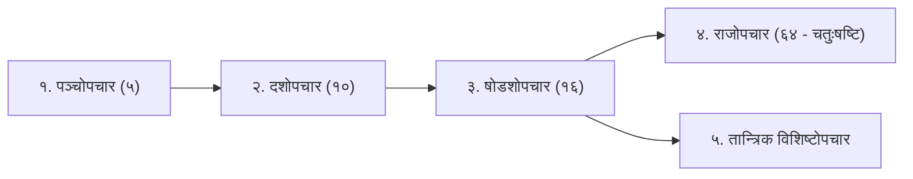

# पूजा विधान एवं तान्त्रिक उपासना मानक निर्देशिका
## Canonical Puja Vidhan & Tantrik Upasana Shastric Standards

जब भी किसी यन्त्र अथवा देवता के लिए **पूजा विधान (Puja Vidhan)**, **उपासना क्रम (Upasana Krama)**, अथवा **साधना पद्धति** का अनुसन्धान और प्रलेखन करना हो, तो निम्नलिखित ७-स्तरीय शास्त्रीय क्रम का पालन करना अनिवार्य है:

---

### १. षडङ्ग शुद्धि एवं पूर्वपीठिका (Preparatory Purification Rites)
1. **आत्मशुद्धि एवं आचमन:**
   - मन्त्र: `ॐ अपवित्रः पवित्रो वा सर्वावस्थां गतोऽपि वा । यः स्मरेत्पुण्डरीकाक्षं स बाह्याभ्यन्तरः शुचिः ॥`
2. **आसन शुद्धि:**
   - आसन: कुशा, ऊन (कम्बल), अथवा मृगचर्म (साधना भेद से)।
   - मन्त्र: `ॐ पृथ्वि त्वया धृता लोका देवि त्वं विष्णुना धृता । त्वं च धारय मां देवि पवित्रं कुरु चासनम् ॥`
3. **दिग्बन्धन एवं भूतशुद्धि:**
   - १० दिशाओं का रक्षण एवं आन्तरिक पंचभूतों (पृथ्वी, जल, अग्नि, वायु, आकाश) का शोधन।
   - मन्त्र: `ॐ अपसर्पन्तु ते भूता ये भूता भूमि संस्थिताः । ये भूता विघ्नकर्तारस्ते नश्यन्तु शिवाज्ञया ॥`
4. **प्राणायाम एवं सङ्कल्प:**
   - देश, काल, तिथि, नक्षत्र, गोत्र, एवं अभीष्ट कार्य का शास्त्रीय सङ्कल्प।

---

### २. यन्त्र शोधन एवं प्राण-प्रतिष्ठा क्रम (Yantra Consecration & Prana Pratishtha)
बिना संस्कार और प्राण-प्रतिष्ठा के यन्त्र केवल रेखाचित्र मात्र होता है। यन्त्र में चेतना जागृत करने का शास्त्रीय क्रम:
1. **पंचामृत एवं तीर्थोदक स्नान:**
   - दूध, दही, घृत, मधु, शर्करा से अभिषेक कर शुद्ध गङ्गाजल से प्रक्षालन।
2. **यन्त्र संस्कार (१० संस्कार):**
   - जनन, जीवन, ताड़न, बोधन, अभिषेक, विमलीकरण, आप्यायन, तर्पण, दीपन, एवं गुप्ति।
3. **प्राण-प्रतिष्ठा मन्त्र:**
   - ऋष्यादि न्यास: ब्रह्मा, विष्णु, रुद्र।
   - मूल मन्त्र:
     `ॐ आं ह्रीं क्रौं यं रं लं वं शं षं सं हं हंसः सोऽहं [देवता का नाम] प्राणा इह प्राणाः । ॐ आं ह्रीं क्रौं... जीव इह स्थितः । ॐ आं ह्रीं क्रौं... सर्वेन्द्रियाणि वाङ्मनश्चक्षुःश्रोत्रजिह्वाघ्राणप्राणा इहागत्य सुखं चिरं तिष्ठन्तु स्वाहा ॥`
4. **दृष्टि उन्मीलन एवं नेत्रोद्घाटन:**
   - सुवर्ण शलाका अथवा दूर्वा द्वारा मधु-घृत से नेत्रोन्मीलन।

---

### ३. न्यास विधि (Nyasa - Divinization of the Body)
साधक अपने शरीर को देवता के यन्त्र-स्वरूप बनाता है:
1. **मातृका न्यास (Matrika Nyasa):** अ से क्ष तक के ५० वर्णों का शरीर में स्थापन।
2. **करन्यास (Kara Nyasa):** अङ्गुष्ठाभ्यां नमः, तर्जनीभ्यां नमः, मध्यमाभ्यां नमः, अनामिकाभ्यां नमः, कनिष्ठिकाभ्यां नमः, करतलकरपृष्ठाभ्यां नमः।
3. **हृदयादि षडङ्गन्यास (Anga Nyasa):** हृदयाय नमः, शिरसे स्वाहा, शिखायै वषट्, कवचाय हुम्, नेत्रत्रयाय वौषट्, अस्त्राय फट्।
4. **यन्त्र-न्यास (Yantra Nyasa):** यन्त्र के विभिन्न आवरणों और कोणों को अपने शरीर के चक्रों में आरोपित करना।

---

### ४. आवरण पूजा (Avarana Puja - Circuit-by-Circuit Worship)
यह यन्त्र साधना का हृदय है।
- **दिशा क्रम:** संहार क्रम (बाहर से भीतर) अथवा सृष्टि क्रम (भीतर से बाहर)।
- प्रत्येक आवरण पर:
  1. आवरण के नाम का उच्चारण (उदा. `ॐ त्रैलोक्यमोहनाय चक्राय नमः`)।
  2. चक्रेश्वरी / योगिनी का आह्वान।
  3. अधिष्ठात्री मुद्रा का प्रदर्शन।
  4. प्रत्येक दल/कोण की शक्ति को गन्ध, अक्षत, पुष्प अथवा बिल्वपत्र/तुलसी अर्पण (उदा. `ॐ अणिमासिद्धये नमः पूजयामि तर्पयामि`)।

---

---

### ५. उपचार विधान - पञ्चोपचार, दशोपचार, षोडशोपचार, राजोपचार एवं विशिष्टोपचार

शास्त्रों में साधन-सामर्थ्य, काल एवं सम्प्रदाय के भेद से ५ प्रकार के उपचार क्रम बताए गए हैं:

#### (क) पञ्चोपचार (Five Basic Offerings - स्थूल पंचभूत प्रतीक)
1. **गन्ध (पृथ्वी तत्व):** चन्दन / अष्टगन्ध अर्पण - `ॐ लं पृथिव्यात्मने गन्धं समर्पयामि नमः ।`
2. **पुष्प (आकाश तत्व):** ऋतु पुष्प / कमल - `ॐ हं आकाशात्मने पुष्पं समर्पयामि नमः ।`
3. **धूप (वायु तत्व):** दशाङ्ग धूप / गुग्गुल - `ॐ यं वाय्वात्मने धूपमाघ्रापयामि नमः ।`
4. **दीप (अग्नि तत्व):** गोघृत अखण्ड दीप - `ॐ रं वह्न्यात्मने दीपं दर्शयामि नमः ।`
5. **नैवेद्य (जल तत्व):** पञ्चामृत / मिष्ठान्न - `ॐ वं अमृतात्मने नैवेद्यं निवेदयामि नमः ।`
*(ताम्बूल/मुद्रा: ॐ सं सर्वात्मने सर्वोपचारपूजां समर्पयामि नमः ।)*

#### (ख) दशोपचार (Ten Offerings)
पाद्य, अर्घ्य, आचमनीय, मधुपर्क, स्नानीय, गन्ध, पुष्प, धूप, दीप, एवं नैवेद्य।

#### (ग) षोडशोपचार (Sixteen Canonical Offerings)
1. **आवाहन (Avahana)** - यन्त्र के केन्द्र में देवता का आमन्त्रण
2. **आसन (Asana)** - दिव्य पीठ समर्पण
3. **पाद्य (Padya)** - चरण प्रक्षालन हेतु सुगन्धित जल
4. **अर्घ्य (Arghya)** - शिर पर समर्पण योग्य गन्ध-पुष्प-युक्त जल
5. **आचमनीय (Achamaniya)** - मुख शुद्धि हेतु कर्पूरयुक्त जल
6. **स्नान (Snana)** - गङ्गाजल, पञ्चामृत अथवा सुगन्धित द्रव्य
7. **वस्त्र एवं उपवस्त्र (Vastra & Upavastra)** - रेशमी पीताम्बर/रक्ताम्बर एवं यज्ञोपवीत
8. **गन्ध (Gandha)** - शुद्ध अष्टगन्ध, चन्दन, कुङ्कुम, रोचना
9. **पुष्प एवं पुष्पमाला (Pushpa)** - इष्ट देवता के प्रिय पुष्प व विल्व/तुलसी
10. **धूप (Dhupa)** - दशाङ्ग धूप अथवा गुग्गुल-अगरु
11. **दीप (Deepa)** - गोघृत अथवा तिल तैल का दीप
12. **नैवेद्य (Naivedya)** - पञ्चमेवा, खीर, मोदक, ऋतुफल
13. **ताम्बूल (Tambula)** - कर्पूर-लवङ्ग-एला युक्त मुखवास
14. **आरती (Aarti / Nirajana)** - कर्पूर दीप द्वारा नीराजन
15. **प्रदक्षिणा एवं नमस्कार (Pradakshina)** - परिक्रमा व साष्टाङ्ग दण्डवत्
16. **विसर्जन / समर्पण (Visarjana)** - `गुह्यातिगुह्यगोप्त्री त्वं...` द्वारा समस्त कर्म समर्पण।

---

#### (घ) राजोपचार (चतुःषष्ट्युपचार - Sixty-Four Royal Offerings)
*तन्त्रराज तन्त्रम्* एवं *श्रीविद्यार्णव तन्त्रम्* के अनुसार सम्राट अथवा जगदीश्वर की भांति भगवती/इष्टदेव को ६४ दिव्य राजसी उपचार अर्पित किए जाते हैं:

1. **आसन (दिव्य रत्न सिंहासन)**
2. **स्वागत (हृदयोल्लासपूर्वक अगवानी)**
3. **पाद्य (चरणाम्बुज प्रक्षालन)**
4. **अर्घ्य (शिरोमणि अर्घ्यदान)**
5. **आचमनीय (मुखशुद्धि वारि)**
6. **मधुपर्क (दधि-मधु-घृत सम्मिश्रण)**
7. **पुनराचमनीय (स्नान-पूर्व आचमन)**
8. **तैलाभ्यङ्ग (सुगन्धित चन्दन-कुङ्कुम तैल मालिश)**
9. **मज्जन (दिव्य स्नानागार प्रवेश)**
10. **चूर्णस्नान (उबटन / हरिद्रा लेप)**
11. **उष्णोदक स्नान (मन्द उष्ण पवित्र जल)**
12. **पञ्चामृत स्नान (दुग्ध, दधि, घृत, मधु, सिता)**
13. **फलोदक स्नान (ताजे फलों का रस)**
14. **तीर्थोदक स्नान (गङ्गादि सप्त सरिताओं का जल)**
15. **शुद्धोदक स्नान (सहस्रधारा स्नान)**
16. **अङ्गमार्जन (दिव्य रेशमी तौलिया से पोंछना)**
17. **वस्त्र (दिव्य परिधान)**
18. **उपवस्त्र (उत्तरीय / दुपट्टा)**
19. **अधिवास (सुगन्धित चन्दन लेपन)**
20. **यज्ञोपवीत (स्वर्ण-रजत-सूत जनेऊ)**
21. **आचमन (वस्त्रोत्तर आचमन)**
22. **भूषण (दिव्य रत्नाभरण - किरीट, कुण्डल, हार)**
23. **पादुका (स्वर्ण/रत्नजटित चरण पादुका)**
24. **रत्नमुकुट (चूड़ामणि मुकुट समर्पण)**
25. **कर्णभूषण (ताटङ्क / मणिकुण्डल)**
26. **नासिकाभूषण (मौक्तिक नथ)**
27. **कण्ठहार (मुक्तावली / एकावली)**
28. **केयूर (भुजबन्द)**
29. **कङ्कण (हस्त कङ्कण / चूड़ियां)**
30. **ऊर्मिका (रत्नाङ्गुलीयक / अंगूठी)**
31. **कटिसूत्र (मेखला / करधनी)**
32. **नूपुर (पाद मञ्जीर / पाजेब)**
33. **पदकटक (पैरों के कड़े)**
34. **कस्तूरी तिलकम (भाल देश पर कस्तूरी-चन्दन)**
35. **सिन्दूर (सीमन्त में दिव्य सिन्दूर)**
36. **कज्जल (नेत्रों में सुगन्धित अञ्जन)**
37. **अंगराग (कुङ्कुम-केसर-चन्दन लेपन)**
38. **पुष्प (अखण्ड पारिजात / कमल दल)**
39. **पुष्पमाला (दीर्घ दिव्य वैजयन्ती माला)**
40. **दशाङ्ग धूप (अगरु-गुग्गुल-चन्दन धूप)**
41. **मणिदीप (रत्नजटित सुवर्ण दीप)**
42. **आरार्तिक (कर्पूर दीप नीराजन)**
43. **नैवेद्य (षड्रस युक्त महाभोग)**
44. **परमान्न (क्षीर / पायसम)**
45. **व्यञ्जन (नानाविध शुद्ध शाक / पकवान)**
46. **पानीयं (सुगन्धित शीतल जल)**
47. **उत्तरापोशन (नैवेद्योत्तर जल)**
48. **हस्तप्रक्षालन (कर-मुख प्रक्षालन जल)**
49. **पुनराचमनीय (अन्तिम आचमन)**
50. **ऋतुफल (ताजे मौसमी फल)**
51. **ताम्बूल (सुवर्ण वर्क मण्डित विरही पान)**
52. **दक्षिणा (सुवर्ण-रजत निष्क दान)**
53. **छत्र (धवल राज छत्र धारण)**
54. **चामर (श्वेत चामर वीजन - चंवर डुलाना)**
55. **व्यजन (मयूरपिच्छ तालवृन्त पङ्खा)**
56. **दर्पण (स्वच्छ सुवर्ण मुकुर / शीशा दिखाना)**
57. **ध्वज (धर्मध्वज समर्पण)**
58. **गीत (सामगान एवं स्तोत्र गायन)**
59. **वाद्य (शङ्ख, भेरी, मृदङ्ग, वीणा वादन)**
60. **नृत्य (शास्त्रीय भाव नृत्य समर्पण)**
61. **स्तुति पाठ (सहस्रनाम / स्तोत्र पाठ)**
62. **प्रदक्षिणा (अष्टविध भाव परिक्रमा)**
63. **साष्टाङ्ग प्रणाम (दण्डवत् नमन)**
64. **आत्मसमर्पण (सर्वस्व समर्पण - 'त्वदीयं वस्तु गोविन्द...')**

---

#### (ङ) तान्त्रिक विशिष्टोपचार (Esoteric & Specialized Tantric Upacharas)
वामकेश्वर तन्त्र एवं श्रीविद्या परम्परा में विशिष्ट तान्त्रिक अनुष्ठानों में निम्नलिखित विशिष्टोपचार अर्पित किए जाते हैं:
1. **पादुका पूजन (Paduka Archana):** गुरु पादुका एवं परमगुरु पादुका अर्चन।
2. **तर्पण (Tarpana):** आनन्द भैरव व चक्र देवियों को सुगन्धित कुङ्कुमोदक से 'पूजयामि तर्पयामि नमः'।
3. **कुल-द्रव्य अर्पण (Kula Dravya Samskara):** शोधित पञ्चतत्वों का सांकेतिक या प्रत्यक्ष अर्पण।
4. **महाबलि (Maha Bali):** उड़द, दही, सिन्दूर मिश्रित बलि (कुष्माण्ड / पेठा अथवा नारियल) दिक्पालों व क्षेत्रपालों को समर्पण।
5. **मुद्रा प्रदर्शन (Mudra Pradarshana):** १० महामुद्राओं (संक्षोभिणी से लेकर सर्वयोनि पर्यन्त) का देवता के सम्मुख प्रदर्शन।
6. **अखण्ड ज्योति समर्पण:** बिना बुझे साधना-पर्यन्त प्रज्वलित रहने वाला घृत स्तम्भ।
7. **रहस्य तर्पण एवं समष्टि विसर्जन:** आवरण की समस्त योगिनियों का स्व-हृदय में लय चिन्तन।

---

### ६. जप, कवच एवं स्तोत्र पाठ (Japa & Recitation)
- **माला चयन:** रुद्राक्ष (शिव/काली), स्फटिक (त्रिपुरसुन्दरी/सरस्वती), तुलसी (विष्णु/राम/कृष्ण), कमलगट्टा (लक्ष्मी), हरिद्रा (बगलामुखी), मूँगा (गणेश/मङ्गल)।
- **संकेत:** यन्त्र के सम्मुख बैठकर मेरु का उल्लंघन किए बिना मन्त्र का उपांशु अथवा मानस जप।
- **कवच:** पूजा के अन्त में उस देवता का शास्त्रीय कवच (उदा. त्रैलोक्य विजय कवच, नारायण कवच) पाठ कर रक्षा की पूर्णता।

---

### ७. शास्त्रीय निषेध एवं सावधानियां (Strict Shastric Guardrails)
- खंडित, मुड़े हुए, अथवा त्रुटिपूर्ण रेखा वाले यन्त्र की कभी भी पूजा नहीं की जाती।
- उग्र तान्त्रिक यन्त्रों (जैसे छिन्नमस्ता, धूमावती, प्रत्यङ्गिरा) की साधना बिना समर्थ गुरु के मार्गदर्शन एवं सात्त्विक कवच के कदापि न करें।
- यन्त्र का मुख सदैव शुद्ध दिशा (पूर्व अथवा उत्तर) में ही होना चाहिए; दक्षिण दिशा केवल विशिष्ट तांत्रिक संहार/शत्रु-शान्ति क्रियाओं में विहित है।
