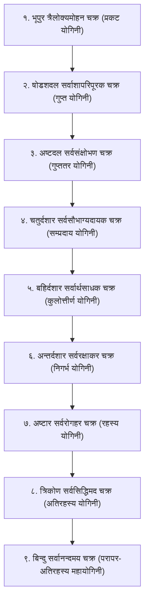

# श्री यन्त्र (श्री चक्र) - महाप्रमाण एवं शास्त्रीय अनुसंधान
## Sri Yantra (Sri Chakra) Master Canonical Research Dossier

---

### १. प्रामाणिक ग्रन्थ एवं पटल संदर्भ (Canonical Scriptures & Chapters)

| क्र.सं. | ग्रन्थ का नाम | रचयिता / सम्प्रदाय | अध्याय / पटल / श्लोक | विषयवस्तु |
|:---:|:---|:---|:---|:---|
| १ | **सौन्दर्यलहरी** | श्रीमदाद्यशङ्कराचार्य (लक्ष्मीधर टीका) | श्लोक ११ | ४३ त्रिकोण, वसुदल, कलादल, त्रिवलय, त्रिरेखा रचना प्रमाण |
| २ | **कामकालाविलासः** | श्रीमत्पुण्यनन्दनाथ (कादि सम्प्रदाय) | श्लोक २२ - ३६ | बिन्दु से भूपुर तक श्री चक्र का तात्त्विक प्रादुर्भाव एवं आवरण योगिनी विचार |
| ३ | **श्रीविद्यार्णव तन्त्रम्** | श्रीमद्विद्यारण्य यतीन्द्र (पूर्वार्द्ध व उत्तरार्द्ध) | पूर्वार्द्ध, पटल १७-२२ | नवावरण देवता, मुद्रा, मन्त्रोद्धार, न्यास एवं विस्तृत पूजाक्रम |
| ४ | **योगिनीहृदयम्** | भैरव-भैरवी संवाद (अमृतानन्दनाथ विरचित 'दीपिका' व भास्कराय कृत 'सेतुबन्ध') | चक्रसङ्केत (प्रथम विश्राम) | चक्र की नवविध सृष्टि, स्थिति व संहार क्रम |
| ५ | **तन्त्रराज तन्त्रम्** | सुभगानन्दनाथ कृत 'मनोरमा' टीका सहित | पटल ५ व ३५ | यन्त्र रेखा-गणित, बिन्दु-त्रिकोण सङ्ख्या एवं अष्टत्रिंशत्कला |

---

### २. यन्त्र रचना एवं रेखा विन्यास श्लोक (Geometric Construction Verses)

#### (क) आधारभूत रचना श्लोक - *सौन्दर्यलहरी (श्लोक ११)*
```sanskrit
चतुर्भिः श्रीकण्ठैः शिवयुवतिभिः पञ्चभिरपि
प्रभिन्नाभिः शम्भोर्नवभिरपि मूलप्रकृतिभिः ।
चतुश्चत्वारिंशद्वसुदलकलाश्रत्रिवलय-
त्रिरेखाभिः सार्धं तव शरणकोणाः परिणताः ॥ ११ ॥
```
**पदच्छेद एवं शास्त्रीय व्याख्या:**
- **चतुर्भिः श्रीकण्ठैः:** ४ ऊर्ध्वमुखी त्रिकोण जो शिव के स्वरूप हैं (Shiva Triangles pointing Upward - Fire/Purusha).
- **शिवयुवतिभिः पञ्चभिः:** ५ अधोमुखी त्रिकोण जो शक्ति की प्रकृतियां हैं (Shakti Triangles pointing Downward - Water/Prakriti).
- **नवभिरपि मूलप्रकृतिभिः:** ये परस्पर संवेष्टित होकर ९ मूल योनियां (मूल प्रकृतियां) बनाती हैं।
- **चतुश्चत्वारिंशत् (४४/४३):** इनके अन्तर्भेदन से ४३ त्रिकोण (मध्य बिन्दु सहित ४४ चक्र घटक) निष्पन्न होते हैं।
- **वसुदल (८ दल):** अष्टदल पद्म (Circle of 8 Lotus Petals).
- **कलाश्र (१६ दल):** षोडशदल पद्म (Circle of 16 Lotus Petals - कला = १६).
- **त्रिवलय:** तीन वृत्त (३ मेखलाएं / concentric circles).
- **त्रिरेखाभिः सार्धं:** भूपुर की तीन रेखाएं (चतुरस्र के ३ प्राकार - Three square boundaries of the Bhupura).
- **तव शरणकोणाः परिणताः:** हे भगवती! यह आपका श्रीचक्र रूप परम मन्दिर परिणत (प्रकट) हुआ है।

---

### ३. ललिता महात्रिपुरसुन्दरी ध्यान श्लोक (Presiding Deity Dhyanam)

#### (क) मूल ध्यान - *ब्रह्माण्डपुराण (ललितासहस्रनाम पूर्वपीठिका) एवं शारदातिलकम्*
```sanskrit
सिन्दूरारुणविग्रहां त्रिनयनां माणिक्यमौलिस्फुरत्-
तारानायकशेखरां स्मितमुखीमापीनवक्षोरुहाम् ।
पाणिभ्यामलिपूर्णरत्नचषकं रक्तोत्पलं बिभ्रतीं
सौम्यां रत्नघटस्थरक्तचरणां ध्यायेत्परामम्बिकाम् ॥

अरुणां करुणातरङ्गिताक्षीं धृतपाशाङ्कुशपुष्पबाणचापाम् ।
अणिमादिभिरावृतां मयूखैरहमित्येव विभावये भवानीम् ॥
ध्यायेत् पद्मासनस्थां विकसितवदनां पद्मपत्रायताक्षीं
हेमाभां पीतवस्त्रां करकलितलसद्धेमपद्मां वराङ्गीम् ।
सर्वालङ्कारयुक्तां सततमभयदां भक्तनम्रां भवानीं
श्रीविद्यां शान्तमूर्तिं सकलसुरनुतां सर्वसम्पत्प्रदात्रीम् ॥
```

#### (ख) चतुर्विध आयुधों का दार्शनिक एवं शास्त्रीय अर्थ:
1. **इक्षुकोदण्ड (इक्षुधनुष - Sugarcane Bow):** 'मनोरूपेक्षुकोदण्डा' — साधक का मन (Mind / संकल्प-विकल्प)।
2. **पञ्चपुष्पबाण (Five Flower Arrows):** 'पञ्चतन्मात्रसायका' — शब्द, स्पर्श, रूप, रस, गन्ध (Five subtle senses of perception: अरविन्द, अशोक, चूत, नवमल्लिका, नीलोत्पल)।
3. **पाश (Noose):** 'रागास्वरूपपाशाढ्या' — प्रेम, आसक्ति व आकर्षण (Attachment/Love).
4. **अङ्कुश (Goad):** 'क्रोधाकाराङ्कुशोज्ज्वला' — विवेक, ज्ञान व नियन्त्रण (Control over anger and lower passions).

---

### ४. मन्त्रोद्धार एवं बीजाक्षर (Mantra Uddhara & Shodashi Vidyas)

श्री विद्या के मुख्य तीन कूट (कादि विद्या - Kadi / Lopamudra Sampradaya) होते हैं:
```sanskrit
॥ क ए ई ल ह्रीं - वाग्भव कूट (प्रथम कूट - अग्नि मण्डल) ॥
॥ ह स क ह ल ह्रीं - कामराज कूट (द्वितीय कूट - सूर्य मण्डल) ॥
॥ स क ल ह्रीं - शक्ति कूट (तृतीय कूट - चन्द्र मण्डल) ॥
```
- **षोडशाक्षरी मन्त्र (Shodashi Mahamantra):**
  `ॐ ऐं ह्रीं श्रीं ऐं क्लीं सौः क ए ई ल ह्रीं ह स क ह ल ह्रीं स क ल ह्रीं श्रीं सौः ऐं क्लीं ह्रीं श्रीं ॥`
- **ऋष्यादि न्यास:**
  - **ऋषि:** आनन्दभैरव (अथवा दक्षिणामूर्ति)
  - **छन्द:** गायत्री
  - **देवता:** श्री ललिता महात्रिपुरसुन्दरी
  - **बीज:** ऐं / क्लीं
  - **शक्ति:** सौः / ह्रीं
  - **कीलक:** श्रीं

---

### ५. श्री चक्र के नवावरण का पूर्ण विवरण (Complete 9 Avarana Invocations)

श्री चक्र में ९ चक्र (Avaranas) बाह्य से अन्तर्मुख (संहार क्रम) अथवा केन्द्र से बाहर (सृष्टि क्रम) में पूजित होते हैं। यहाँ प्रामाणिक संहार-क्रम (बाह्य भूपुर से बिन्दु की ओर) दिया जा रहा है:



#### आवरण १: त्रैलोक्यमोहन चक्र (भूपुर - ३ रेखाएं)
- **योगिनी:** प्रकट योगिनी (Prakata Yogini)
- **चक्रेश्वरी:** त्रिपुरा (Tripura)
- **मुद्रा:** सर्वसंक्षोभिणी मुद्रा (Sarva Sankshobhini Mudra)
- **देवता विवरण:**
  - **प्रथमा रेखा (१० सिद्धियां):** अणिमा, लघिमा, महिमा, ईशित्व, वशित्व, प्राकाम्य, भुक्ति, इच्छा, प्राप्ति, सर्वकाम सिद्धि।
  - **द्वितीया रेखा (८ मातृकाएं):** ब्राह्मी, माहेश्वरी, कौमारी, वैष्णवी, वाराही, माहेन्द्री, चामुण्डा, महालक्ष्मी।
  - **तृतीया रेखा (१० मुद्राएं):** संक्षोभिणी, द्राविणी, आकर्षिणी, वश्यंकरी, उन्मादिनी, महाङ्कुशा, खेचरी, बीज, योनि, त्रिखण्डा।

#### आवरण २: सर्वाशापरिपूरक चक्र (षोडशदल पद्म - 16 Petals)
- **योगिनी:** गुप्त योगिनी (Gupta Yogini)
- **चक्रेश्वरी:** त्रिपुरेशी (Tripureshi)
- **मुद्रा:** सर्वविद्राविणी मुद्रा (Sarva Vidravini Mudra)
- **१६ नित्या/आकर्षण शक्तियां:** कामाकर्षिणी, बुद्ध्याकर्षिणी, अहङ्काराकर्षिणी, शब्दाकर्षिणी, स्पर्शाकर्षिणी, रूपाकर्षिणी, रसाकर्षिणी, गन्धाकर्षिणी, चित्ताकर्षिणी, धैर्याकर्षिणी, स्मृत्याकर्षिणी, नामाकर्षिणी, बीजाकर्षिणी, आत्माकर्षिणी, अमृताकर्षिणी, शरीराकर्षिणी।

#### आवरण ३: सर्वसंक्षोभण चक्र (अष्टदल पद्म - 8 Petals)
- **योगिनी:** गुप्ततर योगिनी (Guptatara Yogini)
- **चक्रेश्वरी:** त्रिपुरसुन्दरी (Tripurasundari)
- **मुद्रा:** सर्वाकर्षिणी मुद्रा (Sarvakarshini Mudra)
- **८ अनङ्ग शक्तियां:** अनङ्गकुसुमा, अनङ्गमेखला, अनङ्ग Donna/मदना, अनङ्गमदनातुरा, अनङ्गरेखा, अनङ्गवेगिनी, अनङ्गाङ्कुशा, अनङ्गमालिनी।

#### आवरण ४: सर्वसौभाग्यदायक चक्र (चतुर्दशार - 14 Triangles)
- **योगिनी:** सम्प्रदाय योगिनी (Sampradaya Yogini)
- **चक्रेश्वरी:** त्रिपुरवासिनी (Tripuravasini)
- **मुद्रा:** सर्ववशंकरी मुद्रा (Sarvavashankari Mudra)
- **१४ कुल शक्तियां:** सर्वसंक्षोभिणी, सर्वविद्राविणी, सर्वाकर्षिणी, सर्वाल्हादिनी, सर्वसम्मोहिनी, सर्वस्तम्भिणी, सर्वजृम्भिणी, सर्ववशंकरी, सर्वरञ्जनी, सर्वोन्मादिनी, सर्वार्थसाधिनी, सर्वसम्पत्तिपूरिणी, सर्वमन्त्रमयी, सर्वद्वन्द्वक्षयंकरी।

#### आवरण ५: सर्वार्थसाधक चक्र (बहिर्दशार - Outer 10 Triangles)
- **योगिनी:** कुलोत्तीर्ण योगिनी (Kulotteerna Yogini)
- **चक्रेश्वरी:** त्रिपुरश्रीः (Tripurashrih)
- **मुद्रा:** सर्वोन्मादिनी मुद्रा (Sarvonmadini Mudra)
- **१० कुलदेवियां:** सर्वसिद्धिप्रदा, सर्वसम्पत्प्रदा, सर्वप्रियंकरी, सर्वमङ्गलकारिणी, सर्वकामप्रदा, सर्वदुःखविमोचिनी, सर्वमृत्युप्रशमनी, सर्वविघ्नविनाशिनी, सर्वाङ्गसुन्दरी, सर्वसौभाग्यदायिनी।

#### आवरण ६: सर्वरक्षाकर चक्र (अन्तर्दशार - Inner 10 Triangles)
- **योगिनी:** निगर्भ योगिनी (Nigarbha Yogini)
- **चक्रेश्वरी:** त्रिपुरमालिनी (Tripuramalini)
- **मुद्रा:** सर्वमहाङ्कुशा मुद्रा (Sarva Mahankusha Mudra)
- **१० निगर्भ शक्तियां:** सर्वज्ञा, सर्वशक्ति, सर्वैश्वर्यप्रदा, सर्वज्ञानमयी, सर्वव्याधिविनाशिनी, सर्वाधारस्वरूपा, सर्वपापहरा, सर्वानन्दमयी, सर्वरक्षास्वरूपिणी, सर्वेप्सितफलप्रदा।

#### आवरण ७: सर्वरोगहर चक्र (अष्टार - 8 Triangles)
- **योगिनी:** रहस्य योगिनी (Rahasya Yogini)
- **चक्रेश्वरी:** त्रिपुरसिद्धा (Tripurasiddha)
- **मुद्रा:** सर्वखेचरी मुद्रा (Sarva Khechari Mudra)
- **८ वाग्देवियां:** वशिनी, कामेश्वरी, मोदिनी, विमला, अरुणा, जयिनी, सर्वेश्वरी, कौलिनी।

#### आवरण ८: सर्वसिद्धिमद चक्र (त्रिकोण - 1 Inner Triangle)
- **योगिनी:** अतिरहस्य योगिनी (Ati-Rahasya Yogini)
- **चक्रेश्वरी:** त्रिपुराम्बा (Tripuramba)
- **मुद्रा:** सर्वबीज मुद्रा (Sarva Beeja Mudra)
- **३ मूल शक्तियां:**
  - **कामेश्वरी** (त्रिकोण का अग्रकोण - ब्रह्मा शक्ति / सृष्टि)
  - **वज्रेश्वरी** (दक्षिण कोण - विष्णु शक्ति / स्थिति)
  - **भगमालिनी** (उत्तर कोण - रुद्र शक्ति / संहार)

#### आवरण ९: सर्वानन्दमय चक्र (महाबिन्दु - Central Bindu)
- **योगिनी:** परापर-अतिरहस्य योगिनी (Parapara-Atirahasya Yogini)
- **चक्रेश्वरी:** श्री श्री महात्रिपुरसुन्दरी (महाभट्टारिका राजराजेश्वरी)
- **मुद्रा:** सर्वयोनि मुद्रा (Sarva Yoni Mudra)
- **तत्व:** शिव-शक्ति सामरस्य (अविनाभाव अद्वैत सम्बन्ध - कामेश्वर अङ्कनिलया)।

---

### ६. फलश्रुति एवं प्रतिष्ठा-विधान (Shastric Consecration Rules)
- **उत्तम द्रव्य:** अष्टधातु, शुद्ध ताम्र, स्वर्ण, पारद (पारद श्रीयन्त्र), अथवा स्फटिक (स्फटिक मेरु)।
- **दिशानिर्देश:** पूर्वाभिमुख अथवा उत्तराभिमुख प्रतिष्ठा।
- **अभिषेक द्रव्य:** पञ्चामृत, शुद्ध गङ्गाजल, कुङ्कुमोदक (कुङ्कुम अर्चन - ललितासहस्रनाम/त्रिशती पाठ सहित)।
- **शास्त्रीय फल:** समस्त प्रकार की दरिद्रता का समूल नाश, राजयोग, ज्ञान-मेधा, मोक्ष एवं भुक्ति-मुक्ति का एक साथ प्रदान।
