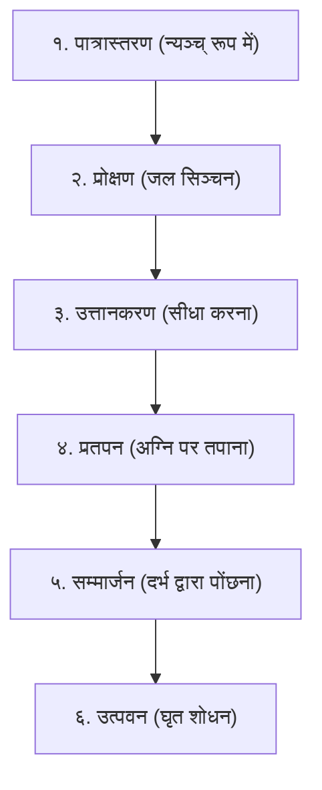

# पात्रसादन महाशोध डॉसियर (Patrasadana Canonical Shastric Research Dossier)
## वैदिक श्रौत, स्मार्त एवं तान्त्रिक यज्ञ-पात्र विन्यास, काष्ठ-विज्ञान, गणितीय माप एवं सम्मार्जन विधान

---

### १. प्रस्तावना एवं शास्त्रीय उद्भव (Scriptural Origin & Authority)

वैदिक एवं तान्त्रिक यज्ञानुष्ठान में **पात्रसादन (Pātrasādanam)** कुण्ड में अग्नि प्रज्वलित करने और आहुति आरम्भ करने से पूर्व की सर्वाधिक पवित्र, वैज्ञानिक और अनिवार्य प्रक्रिया है। 

'पात्र' का अर्थ है यज्ञ के पवित्र काष्ठ व धातु उपकरण, तथा 'सादन' का अर्थ है उन्हें शास्त्रीय मन्त्रों द्वारा कुण्ड के उत्तर/ईशान भाग में बिछे दर्भ (कुश) पर यथास्थान प्रतिष्ठित करना।

#### प्रमुख प्रमाण ग्रन्थ:
1. **शतपथ ब्राह्मणम् (काण्ड १, प्रपाठक १, ब्राह्मण १, कण्डिका २२):**
   ```sanskrit
   द्वन्द्वं पात्राणि प्रयुनक्ति । द्वन्द्वं वै वीर्यं मिथुनमेव तत्प्रजननं क्रियते ॥
   ```
   *भावार्थ:* अध्वर्यु यज्ञ-पात्रों को दो-दो के जोड़े (द्वन्द्व/मिथुन) रूप में वेदी पर स्थापित करता है। यह ब्रह्माण्डीय प्राण और अपान, सूर्य और सोम, तथा प्रकृति और पुरुष के मिथुन (सृष्टि-उत्पादक सामञ्जस्य) का प्रतीक है।

2. **कात्यायन श्रौतसूत्रम् (अध्याय १, खण्ड ३):**
   ```sanskrit
   उदीच्यां पात्राणि सादयति । पूर्वाग्राण्युत्तराग्राणि वा बर्ही षि संस्तीर्य ॥
   ```
   *भावार्थ:* कुण्ड/वेदी के उत्तर (उदीची) भाग में पूर्व की ओर अथवा उत्तर की ओर अग्रभाग वाले कुशों को आच्छादित कर उन पर यज्ञपात्रों का सादन किया जाता है।

3. **पारस्कर गृह्यसूत्रम् (काण्ड १, कण्डिका १-२) - कुशकण्डिका विधान:**
   ```sanskrit
   उत्तरतः पात्रासादनं स्फ्यश्च कपाली च शूर्पं चाजिनं चोलूखलमुसले चेध्मप्रस्तरबर्ही षि परिधयश्च स्रुक्स्रुवौ च ॥
   ```
   *भावार्थ:* पारस्कर के अनुसार कुण्ड के उत्तर में पवित्र कुशों पर स्फ्य, कपाली, शूर्प, कृष्णाजिन, उलूखल-मुसल, इध्म, प्रस्तर, बर्हि, परिधि तथा स्रुक्-स्रुवा आदि पात्रों को शास्त्रोक्त क्रम से स्थापित किया जाता है।

4. **शारदातिलकम् (पटल ४, श्लोक ३१-३८):**
   ```sanskrit
   कुण्डस्य चोत्तरे भागे दर्भानास्तीर्य यत्नतः ।
   तत्र पात्राणि निक्षिप्य प्रोक्षयेत्कुशवारिणा ॥
   स्रुक्स्रुवौ च तथा स्फ्यं प्रणीतां प्रोक्षणीमपि ।
   आज्यस्थालीं चरुस्थालीं सम्मार्जयेद्यथाविधि ॥
   ```

5. **मन्त्रमहोदधिः (प्रथम तरङ्ग) एवं आपस्तम्ब श्रौतसूत्रम् (प्रश्ना १-३)।**

---

### २. पात्रसादन के ३ मौलिक सिद्धान्त (Foundational Principles)

```
                     ┌────────────────────────────────────────────────────────┐
                     │               उत्तर दिशा (उदीची / सोम स्थान)           │
                     ├────────────────────────────────────────────────────────┤
                     │         पात्रसादन वेदी (कुशों का पूर्वाग्र/उत्तराग्र आस्तरण)    │
                     │                                                        │
                     │  [प्रणीता]  [प्रोक्षणी]   [आज्यस्थाली]  [चरुस्थाली]       │
                     │  [स्रुक्]   [स्रुवा]     [स्फ्य (काष्ठ)] [उपवेष/धृष्टि]    │
                     │  [इध्म]     [बर्हि/कुश]  [प्रस्तर]     [परिधि त्रय]       │
                     └────────────────────────────────────────────────────────┘
                                                 ▲
                                                 │
                                                 │ (उत्तर दिशा में स्थित)
                                                 ▼
                                     ┌───────────────────────┐
                                     │                       │
                                     │     यज्ञ कुण्ड        │
                                     │   (अग्नि का स्थान)    │
                                     │                       │
                                     └───────────────────────┘
                                                 ▲
                                                 │
                                                 │ (दक्षिण/पश्चिम)
                                                 ▼
                                           [यजमान / होता]
```

#### १. द्वन्द्व नियम (The Law of Pairs / Mithuna):
वैदिक ऋषियों ने देखा कि विश्व में शक्ति द्वन्द्व में ही क्रियाशील होती है। अतः पात्र भी जोड़ों में स्थापित होते हैं:
- **प्रणीता और प्रोक्षणी:** वरुण (शान्ति) एवं सविता (शोधन)।
- **स्रुक् और स्रुवा:** योषा (स्त्री/प्रकृति) एवं वृषा (पुरुष/वीर्य)।
- **आज्यस्थाली और चरुस्थाली:** स्नेह (घृत) एवं अन्न (पुष्टि)।
- **स्फ्य और उपवेष:** तीक्ष्ण ज्ञान-खड्ग एवं कर्म-व्यवस्था।
- **इध्म और बर्हि:** प्रदीपन (अग्नि) एवं आस्तरण (शान्ति)।

#### २. उदीची (उत्तर दिशा) का रहस्य:
उत्तर दिशा देवयान मार्ग, सोम, कुबेर और अमृत की दिशा है। दक्षिण दिशा यम और पितरों की (उष्ण) दिशा है। कुण्ड में अग्नि प्रज्वलित होकर दक्षिण की उष्णता उत्पन्न करती है, अतः उसके सन्तुलन हेतु शीतल अमृत-स्वरूपा सोम-दिशा (उत्तर) में पवित्र जल व घृतादि पात्र स्थापित किए जाते हैं।

#### ३. न्यञ्च् से उत्तान (Inverted to Upright Transition):
- **न्यञ्च् (औंधा):** जब पात्र सर्वप्रथम वेदी पर रखे जाते हैं, तो उनका मुख नीचे (अधोमुख) होता है। यह सूक्ष्म संकेत है कि सांसारिक प्रपञ्चों और धूलि-कणों से पात्र सुरक्षित रहें।
- **उत्तान (सीधा):** जब प्रोक्षणी जल और दर्भ से उनका सम्मार्जन (शुद्धिकरण) हो जाता है, तब उन्हें सीधा (ऊर्ध्वमुख) कर दिया जाता है, जिससे वे दिव्य हविष्य ग्रहण करने योग्य बन जाते हैं।

#### ४. पात्र-पीठ यन्त्र विन्यास (The Sacred Mandalas Drawn Underneath Each Vessel):
शास्त्रों में स्पष्ट निर्देश है कि दर्भ-वेदी पर किसी भी यज्ञ-पात्र को सीधे नग्न भूमि या मात्र तृण पर नहीं रखा जाता, अपितु प्रत्येक पात्र के नीचे चन्दन, कुङ्कुम, हरिद्रा अथवा अक्षत-चूर्ण से एक विशिष्ट **यन्त्र / मण्डल (Patra-Pitha Mandala)** निर्मित किया जाता है:

*शारदातिलकम्* (पटल ४, श्लोक ३१-३४):
```sanskrit
चतुरस्रं त्रिकोणं वा वृत्तं वा मण्डलं लिखेत् ।
गन्धेन कुङ्कुमेनाथ तत्र पात्राणि सादयेत् ॥
वारुणं वह्निजं सौम्यं पार्थिवं वैष्णवं तथा ।
बीजैर्युक्तं लिखेत्पीठे पात्राणां धारणात्मने ॥
```
*मन्त्रमहोदधि* (प्रथम तरङ्ग, श्लोक ५५-५८):
```sanskrit
अधस्तात्पात्रसंघस्य मण्डलं विन्यसेत्क्रमात् ।
विना यन्त्रेण यत्पात्रं सादितं निष्फलं भवेत् ॥
```

| क्र. | पात्र का नाम | अधः-स्थापित यन्त्र / मण्डल | द्रव्य (Paste/Powder) | बीज मन्त्र | दार्शनिक प्रयोजन |
|:---:|:---|:---|:---|:---:|:---|
| १ | **प्रणीता पात्र** | **वारुण अष्टदल मण्डल** (वृत्त-त्रिकोण-पद्म) | श्वेत चन्दन + अक्षत | `वं` | अमृत-तत्व का आवाहन एवं यज्ञ-रक्षा |
| २ | **प्रोक्षणी पात्र** | **षट्कोण वारुण मण्डल** (Hexagram with Lotus) | श्वेत चन्दन + कपूर | `वं` | प्रोक्षण जल की पवित्रीकरण शक्ति |
| ३ | **स्रुक् (महाहवणी)**| **अग्नि त्रिकोण यन्त्र** (ऊर्ध्वमुखी त्रिकोण + स्वस्तिक) | रक्त चन्दन + कुङ्कुम | `रं` | हव्यवाहन अग्नि की दिव्य ज्वाला का आवाहन |
| ४ | **स्रुवा (आहुति दण्ड)**| **अग्नि-सोम मण्डल** (त्रिकोण-वृत्त संगम) | रक्त चन्दन + रोली | `रं` | आहुति प्रवाह में प्राण-अपान सन्तुलन |
| ५ | **आज्यस्थाली** | **सौम्य सूर्य-चन्द्र मण्डल** (द्वादशार सूर्य चक्र) | हरिद्रा (हल्दी) + केशर | `सौः / ह्रीं` | गोघृत की पुष्टि, स्निग्धता व अमृतत्व |
| ६ | **चरुस्थाली** | **पार्थिव चतुरस्र भूपुर मण्डल** (Square Pitha) | अष्टगन्ध + अक्षत | `लं` | पृथ्वी माता का अन्न-पोषण तत्व |
| ७ | **स्फ्य (काष्ठ खड्ग)** | **वायव्य वज्र मण्डल** (षटार वज्र चक्र) | सिन्दूर + चन्दन | `यं` | विघ्न-विदारण एवं आसुरी शक्ति संहार |
| ८ | **उपवेष (धृष्टि)** | **आग्नेय मण्डल** (अग्नि-शिखा यन्त्र) | रक्त चन्दन | `रं` | अंगार प्रदीपन व अग्नि समन्वय |
| ९ | **इध्म (२१ समिधा)** | **अष्टकोण स्वस्तिक पीठ** (Swastika Pitha) | कुङ्कुम + अक्षत | `ॐ` | सामिधेनी मन्त्रों का आधार |
| १० | **बर्हि व प्रस्तर** | **ब्रह्म-मण्डल** (पद्म-पीठ) | श्वेत चन्दन | `हं` | यजमान की आध्यात्मिक प्रतिष्ठा |
| ११ | **परिधि त्रय** | **त्रैलोक्य रक्षा मण्डल** (त्रि-रेखा परिधि चक्र) | चन्दन-कुङ्कुम | `फट्` | आधिभौतिक, आधिदैविक, आध्यात्मिक रक्षा |
| १२ | **संस्रवपात्र** | **चन्द्र मण्डल** (अर्धचन्द्र/पूर्णवृत्त) | श्वेत चन्दन | `सोमं` | अवशिष्ट अमृत घृत का संचय |

---

### ३. षोडश (१६) प्रमुख यज्ञ-पात्र: काष्ठ, माप, लक्षण एवं मन्त्र

#### १. स्रुक् (Sruk - महाहवणी / जुहू)
- **वैदिक संज्ञा:** स्रुक्, जुहू, महाहवणी।
- **शास्त्रीय काष्ठ:** **पलाश (Butea monosperma / ढाक)** अथवा वैणव (बांस)।
  - *काष्ठ रहस्य:* पलाश को "ब्रह्मवृक्ष" कहा जाता है (*"पलाशो वा अर्कः"* - शतपथ)। पलाश की स्रुक् से दी गई आहुति ब्रह्मतेज की वृद्धि करती है।
- **मानक माप:**
  - कुल लम्बाई: **१ बाहु / १ हस्त (२४ अंगुल = १८ इंच = ४५.७ सेमी)**
  - दण्ड (Handle): १८ अंगुल (१३.५ इंच)
  - बिल (Bowl): ६ अंगुल (४.५ इंच) लम्बा, ४ अंगुल चौड़ा।
  - गहराई: १.५ अंगुल (१.१ इंच)।
- **ज्यामितीय आकार:** अग्रभाग में हाथी की सूण्ड (*हस्त्याकार/शुण्डिकामुख*) अथवा हंस की चोंच सदृश जलनिर्गम छिद्र।
- **उपयोग:** वसोर्धारा, आज्यभाग, महाव्याहृति, तथा पूर्णाहुति का मुख्य पात्र।
- **सादन मन्त्र:** `ॐ जुहूरसि घृताची नाम्ना प्रियेण नाम्ना प्रियं सद आसीद ॥`

---

#### २. स्रुवा (Sruva - प्रधान आहुति साधन)
- **वैदिक संज्ञा:** स्रुव, आहुति-चमच।
- **शास्त्रीय काष्ठ:** **खदिर (Acacia catechu / खैर)**।
  - *काष्ठ रहस्य:* *"खदिरो वै वीर्यम्"* - खदिर अत्यन्त कठोर, अग्नि-सहिष्णु और मङ्गल/इन्द्र का तेज समाहित करने वाला काष्ठ है।
- **मानक माप:**
  - कुल लम्बाई: **१ अरत्नि (२४ अंगुल = १८ इंच = ४५.७ सेमी)**
  - दण्ड: पतला, सुडौल, अग्रभाग में मुकुटाकार।
  - गोल कटोरा (पुष्कर): व्यास २ अंगुल (१.५ इंच), गहराई १ अंगुल (०.७५ इंच)।
- **ज्यामितीय आकार:** पूर्ण वृत्ताकार अग्र-कटोरा, जिसके किनारों पर घृत न गिरे ऐसी सूक्ष्म धार होती है।
- **उपयोग:** कुण्ड में नित्य सहस्रों मन्त्र आहुतियां देने का सर्वप्रधान साधन। स्रुवा के बिना कोई होम सम्भव नहीं।
- **सादन मन्त्र:** `ॐ उपभृदसि घृताची नाम्ना प्रियेण नाम्ना प्रियं सद आसीद ॥`

---

#### ३. स्फ्य (Sphya - काष्ठ खड्ग)
- **वैदिक संज्ञा:** स्फ्य, यज्ञासि।
- **शास्त्रीय काष्ठ:** **खदिर (खैर)** काष्ठ।
- **मानक माप:**
  - लम्बाई: **१ प्रादेश / १ वितस्ति (१२ अंगुल = ९ इंच = २२.८ सेमी)**
  - चौड़ाई: २ अंगुल (१.५ इंच)
  - मोटाई: ०.५ अंगुल।
- **ज्यामितीय आकार:** एक धार वाली काष्ठ की तलवार (Sword-shaped blade) जिसकी नोक नुकीली होती है।
- **उपयोग:** 
  1. पञ्चभूसंस्कार में कुण्ड के तल पर ६ पवित्र रेखाएं खींचना (उल्लेखन)।
  2. दर्भ/कुश का पवित्र-च्छेदन करना।
  3. वेदी पर रेखाएं अंकित करना।
- **सादन मन्त्र:** `ॐ इन्द्रस्य वज्रोऽसि वार्त्रघ्नः स्तनयित्नुमान् ॥`

---

#### ४. प्रणीता पात्र (Pranita - ब्रह्मवारि पात्र)
- **वैदिक संज्ञा:** प्रणीताप्रणयन पात्र।
- **शास्त्रीय काष्ठ / धातु:** **वारण (Crataeva nurvala / वरुण वृक्ष)** अथवा **शुद्ध ताम्र (तांबा)**।
- **मानक माप:**
  - आकार: चतुरस्र (आयताकार/चौकोर)।
  - लम्बाई: ८ अंगुल (६ इंच)
  - चौड़ाई: ४ अंगुल (३ इंच)
  - गहराई: ३ अंगुल (२.२५ इंच)।
- **ज्यामितीय आकार:** चपटा तला, चारों ओर उठे हुए किनारे, समकोण कोने।
- **उपयोग:** इसमें शुद्ध जल भरकर कुशाओं द्वारा 'ब्रह्म' के रूप में प्रतिष्ठित किया जाता है। यह समस्त यज्ञ की अनिष्ट शक्तियों से रक्षा करता है।
- **सादन मन्त्र:** `ॐ प्रणीताभ्यो नमः । आपो देवीरमृता ऋतावृधः ॥`

---

#### ५. प्रोक्षणी पात्र (Prokshani - पवित्रक जल पात्र)
- **वैदिक संज्ञा:** प्रोक्षणीपात्र।
- **शास्त्रीय काष्ठ / धातु:** **वारण काष्ठ**, ताम्र, अथवा कांस्य।
- **मानक माप:**
  - लम्बाई: ८ अंगुल (६ इंच)
  - चौड़ाई: ४ अंगुल (३ इंच)
  - अग्रभाग: गोस्तनाकार (गाय के थन सदृश) अथवा मयूर-मुखाकार ढालू मुख।
- **उपयोग:** इसमें पवित्र जल और दो कुश-पवित्री रखी जाती हैं। यज्ञ सामग्री, समिधा, कुण्ड और दिशाओं का प्रोक्षण (पवित्रीकरण) इसी पात्र के जल से किया जाता है।
- **सादन मन्त्र:** `ॐ प्रोक्षणीभ्यो नमः । देवस्य त्वा सवितुः प्रसवेऽश्विनोर्बाहुभ्यां पूष्णो हस्ताभ्याम् ॥`

---

#### ६. आज्यस्थाली (Ajyasthali - घृत कलश)
- **वैदिक संज्ञा:** आज्यपात्र, घृतकुम्भ।
- **शास्त्रीय धातु:** **विशुद्ध कांस्य (Bell Metal / Bronze)** अथवा **ताम्र**। (लोहा, सीसा, एल्युमिनियम घोर निषिद्ध)।
- **मानक माप:**
  - कुण्ड के प्रमाणानुरूप (क्षमता ५०० ग्राम से ५ कि.ग्रा.)।
  - ऊँचाई: ६ से ८ अंगुल।
  - मुख: चौड़ा व गोल, ताकि स्रुवा सुगमता से प्रवेश कर सके।
- **उपयोग:** हवन हेतु शुद्ध गोघृत को अग्नि के उत्तर भाग में तपाकर, उल्मुक घुमाकर, पवित्रियों से उत्पवन कर इसी में सुरक्षित रखा जाता है।
- **सादन मन्त्र:** `ॐ आज्यस्थाल्यै नमः । मही द्यौः पृथिवी च न इमं यज्ञं मिमिक्षताम् ॥`

---

#### ७. चरुस्थाली / चरुपात्र (Charusthali - पक्वान्न हविष्य पात्र)
- **वैदिक संज्ञा:** चरुस्थाली, कुम्भी।
- **शास्त्रीय धातु / उपादान:** **कांस्य, ताम्र, अथवा सुघटित पवित्र मृत्तिका (Clay)**।
- **मानक माप:**
  - गोल कलशाकार, गर्दन संकुचित और उदर विस्तृत।
- **उपयोग:** दूध, चावल, घी और शर्करा युक्त चरु (खीर/हविष्य) पकाने और आहुति हेतु रखने का पात्र।
- **सादन मन्त्र:** `ॐ चरुस्थाल्यै नमः । अन्नपतेऽन्नस्य नो देह्यनमीवस्य शुष्मिणः ॥`

---

#### ८. उपवेष / धृष्टि (Upavesha / Dhrishti - काष्ठ दण्ड)
- **वैदिक संज्ञा:** उपवेष, धृष्टि।
- **शास्त्रीय काष्ठ:** **पलाश** अथवा **शमी (Prosopis cineraria)**।
- **मानक माप:**
  - लम्बाई: **१ बाहु (१ हस्त = २४ अंगुल = १८ इंच)**
  - अग्रभाग: चपटा (हथेलियाकार/फावड़ा सदृश)।
- **उपयोग:** जलते हुए अंगारों और समिधाओं को कुण्ड के भीतर बिना हाथ से छुए व्यवस्थित करना। अग्नि को बुझने से बचाना।
- **सादन मन्त्र:** `ॐ उपवेषोऽसि धृष्टिरसि ब्रह्मणा त्वा सन्दधामि ॥`

---

#### ९. इध्म (Idhma - २१/१५ समिधा बन्धन)
- **वैदिक संज्ञा:** इध्मप्रव्रश्चन।
- **शास्त्रीय काष्ठ:** पलाश, खदिर, अथवा शमी।
- **प्रमाण संख्या:** **२१ समिधाएं** (अथवा १५ समिधाएं)।
  - १ समिधा: अग्नि आधान हेतु।
  - ३ समिधाएं: परिधि हेतु।
  - २ समिधाएं: अग्नि प्रदीपन हेतु।
  - १५ समिधाएं: सामिधेनी मन्त्रों के साथ आहुति हेतु।
- **मानक लम्बाई:** **१ प्रादेश (१० से १२ इंच)**, सीधे, बिना गांठ व कीड़े वाले।
- **बन्धन:** कुश की तिहरी बंटी हुई डोरी (इध्म-नद्धन) से बंधी हुई।
- **सादन मन्त्र:** `ॐ इध्ममसि स्वाहा । जातवेदसे नमः ॥`

---

#### १०. बर्हि (Barhi - परिस्तरण कुश गुच्छ)
- **वैदिक संज्ञा:** बर्हि, दर्भ-संहति।
- **उपादान:** भाद्रपद मास की अमावस्या को विधिपूर्वक उखाड़े गए **विशुद्ध दर्भ (कुश)**।
- **मानक लम्बाई:** १ हस्त (१८ इंच), अग्रभाग अक्षत (कटे-फटे न हों)।
- **उपयोग:** कुण्ड के चारों किनारों पर आच्छादन (परिस्तरण) और वेदी पर आसन बिछाने हेतु।
- **सादन मन्त्र:** `ॐ बर्हिषे नमः । ऊर्णाम्रदसं त्वा स्तृणामि स्वासस्थां देवेभ्यः ॥`

---

#### ११. परिधि त्रय (Paridhi Traya - सुरक्षात्मक सीमा काष्ठ)
- **वैदिक संज्ञा:** मध्यम परिधि, दक्षिण परिधि, उत्तर परिधि।
- **शास्त्रीय काष्ठ:** **पलाश, शमी, अथवा औदुम्बर**।
- **मानक माप:**
  - **मध्यम परिधि (पश्चिम भाग):** स्थूल (मोटी), लम्बाई १ बाहु (२४ अंगुल)।
  - **दक्षिण परिधि (दक्षिण भाग):** मध्यम, लम्बाई १ बाहु (२४ अंगुल)।
  - **उत्तर परिधि (उत्तर भाग):** सूक्ष्म (पतली), लम्बाई १ बाहु (२४ अंगुल)।
- **दार्शनिक रहस्य:** यह कुण्ड में अग्नि की तीन सीमाओं (पृथ्वी, अन्तरिक्ष, द्युलोक) और यजमान की तीनों तापों (आधिभौतिक, आधिदैविक, आध्यात्मिक) से रक्षा करती हैं।
- **सादन मन्त्र:** `ॐ गन्धर्वोऽसि विश्वावसुः परिधिरसि ॥`

---

#### १२. प्रस्तर (Prastara - यजमान कुश स्तम्भ)
- **वैदिक संज्ञा:** प्रस्तर।
- **उपादान:** बर्हि में से निकाला गया श्रेष्ठ कुश-गुच्छ (१ मुट्ठी भर)।
- **रहस्य:** यह साक्षात् यजमान का प्रतिनिधि होता है। इसे सूक्तवाक मन्त्र के साथ अन्त में अग्नि में विसर्जित किया जाता है।
- **सादन मन्त्र:** `ॐ प्रस्तरोऽसि यजमानो वै प्रस्तरः ॥`

---

#### १३. कपाली / कपाल (Kapala - पुरोडाश पक्वान्न खण्ड)
- **उपादान:** पकी हुई शुद्ध मिट्टी की टिकिया/प्लेट्स।
- **उपयोग:** वैदिक श्रौत यज्ञों में पुरोडाश (यव-चावल की रोटी) पकाने हेतु।

---

#### १४. शूर्प (Shurpa - पवित्र वेणु छाज)
- **उपादान:** बांस (वेणु) से निर्मित छाजड़ा।
- **उपयोग:** यव, तिल, चावल आदि को फटककर कण, भूसी और कंकड़ से मुक्त करना।

---

#### १५. उलूखल एवं मुसल (Ulukhala & Musala - ओखली व मूसल)
- **शास्त्रीय काष्ठ:** **वारण (वरुण)** अथवा **पलाश**।
- **उपयोग:** हविष्य हेतु धान्य (धान/जौ) को कूटकर अक्षत बनाने हेतु।

---

#### १६. संस्रवपात्र (Sansrava Patra - अवशिष्ट घृत पात्र)
- **शास्त्रीय धातु:** कांस्य अथवा ताम्र।
- **उपयोग:** स्रुवा से आहुति देते समय टपकने वाले पवित्र घृत-बिन्दुओं (संस्रव) को एकत्र करना, जिसका बाद में यजमान मार्जन व प्राशन करता है।

---

### ४. पात्रसादन की ४ प्रमुख शाखा-पद्धतियां (Tradition Comparative Matrix)

| क्रम / तत्त्व | १. शुक्ल यजुर्वेदीय (वाजसनेयी/पारस्कर) | २. ऋग्वेदीय (आश्वलायन) | ३. कृष्ण यजुर्वेदीय (आपस्तम्ब/तैत्तिरीय) | ४. तान्त्रिक/शाक्त (शारदातिलकम्) |
|:---|:---|:---|:---|:---|
| **वेदी दिशा** | कुण्ड के ठीक उत्तर (उदीची) | उत्तर-ईशान (ब्रह्म-समीप) | उत्तर में पश्चिमाग्र बर्हि पर | कुण्ड के ईशान में अष्टदल मण्डल |
| **कुश आस्तरण** | उत्तराग्र एवं पूर्वाग्र कुश | पूर्वाग्र दर्भ श्रेणी | उत्तराग्र दर्भ श्रेणी | चतुरस्र यन्त्रवत् आस्तरण |
| **प्रारम्भिक क्रम** | स्फ्य, कपाली, शूर्प, प्रणीता, प्रोक्षणी | प्रणीता, प्रोक्षणी, आज्यस्थाली, स्रुक्, स्रुवा | अग्निहोत्रहवणी, जुहू, उपभृत्, ध्रुवा | शङ्ख, अस्त्रपात्र, प्रणीता, स्रुक्, स्रुवा |
| **सम्माज्जन विधि** | कुश-मूल व अग्र से षड्विध | कुश-पवित्रक द्वारा | त्रिविध प्रोक्षण व प्रतपन | मन्त्र न्यास एवं अस्त्र फट् शोधन |
| **घृत उत्पवन** | २ कुश पवित्रियों द्वारा ३ बार | सवितृ मन्त्र द्वारा | सूर्य रश्मि ध्यान सहित | वाग्भव एवं कामराज बीज द्वारा |

---

### ५. पात्र संस्कार एवं सम्मार्जन की षड्विध वैज्ञानिक प्रक्रिया



1. **१. पात्रास्तरण (Laying in Inverted State):**
   - कुण्ड के उत्तर में पवित्र भूमि पर कुशाएं बिछाकर सभी पात्रों को औंधा (न्यञ्च्) रखा जाता है।
2. **२. प्रोक्षण संस्कार:**
   - प्रोक्षणी पात्र में जल भरकर `ॐ अपो देवीरुपसृज...` मन्त्र से कुशों द्वारा सभी पात्रों पर जल छिड़का जाता है।
3. **३. उत्तानकरण (Turning Upright):**
   - प्रत्येक पात्र को मन्त्रोच्चार के साथ सीधा (मुख ऊपर) किया जाता है।
4. **४. प्रतपन संस्कार (Thermal Sterilization):**
   - स्रुक्, स्रुवा और स्फ्य को प्रदीप्त अग्नि की ज्वालाओं पर आगे-पीछे तपाया जाता है, जिससे सूक्ष्म जीवाणु और काष्ठ की नमी पूर्णतः नष्ट हो जाए।
5. **५. सम्मार्जन (Mechanical Cleansing with Kusha):**
   - कुश के अग्रभाग (अग्र) से पात्र के भीतरी भाग को साफ किया जाता है।
   - कुश के मूल भाग (जड़) से पात्र के बाह्य भाग को पोंछा जाता है।
   - पुनः प्रोक्षणी जल से धोकर अग्नि पर तपाया जाता है।
6. **६. उत्पवन (Electro-Magnetic / Divine Purification):**
   - दो अखंडित कुश-पवित्रियों को अंगूठे व अनामिका से पकड़कर घृतपात्र में डुबोकर तीन बार ऊपर उठाया जाता है:
     ```sanskrit
     ॐ सविता त्वा पुनातु अच्छिद्रेण पवित्रेण वसोः सूर्यस्य रश्मिभिः स्वाहा ॥
     ```

---

### ६. आगामी तकनीकी एवं विज़ुअल कार्यान्वयन योजना (Implementation Blueprint)

उपर्युक्त शोध के आधार पर ॲप में निम्नलिखित सम्पत्तियां (Assets) व कोड मॉड्यूल विकसित किए जाएंगे:

1. **वेक्टर आर्ट डिज़ाइन्स (`public/patrasadana/`):**
   - `sruk.svg` — पलाश काष्ठ की हाथी-सूण्ड युक्त स्रुक् (१०००×१००० शुद्ध SVG)।
   - `sruva.svg` — खदिर काष्ठ का गोल आहुति स्रुवा।
   - `sphya.svg` — खदिर काष्ठ का खड्गाकार स्फ्य।
   - `pranita_patra.svg` — चतुरस्र वारण काष्ठ/ताम्र प्रणीता पात्र।
   - `prokshani_patra.svg` — गोस्तनाकार मुख वाला प्रोक्षणी पात्र।
   - `ajyasthali.svg` — कांस्य का घृत कलश।
   - `charusthali.svg` — हविष्य पात्र।
   - `upavesha.svg` — काष्ठ दण्ड (धृष्टि)।
   - `idhma_bundle.svg` — २१ समिधाओं का कुश-बद्ध बंडल।
   - `paridhi_traya.svg` — मध्यम, दक्षिण और उत्तर परिधि काष्ठ।
   - `patrasadana_altar_board.svg` — सम्पूर्ण पात्रसादन वेदी का विहङ्गम मास्टर लेआउट।

2. **डेटाबेस इंजन (`src/lib/patrasadana/patrasadana-database.ts`):**
   - १६ पात्रों का सम्पूर्ण डेटाबेस (काष्ठ, धातु, लम्बाई, चौड़ाई, मन्त्र, विनियोग, शाखा-भेद)।
   - स्टेट इंजन: न्यञ्च् (Inverted) ⟷ उत्तान (Upright) टॉगल।

3. **इंटरएक्टिव यूआई पोर्टल (`src/app/patrasadana/page.tsx`):**
   - दृश्य पात्रसादन वेदी (कुण्ड के उत्तर में संरेखित)।
   - पात्रों पर क्लिक करने पर 3D/SVG इन्स्पेक्टर, काष्ठ-विज्ञान विवरण और वैदिक मन्त्र ऑडिओ/टेक्स्ट।
   - शाखा चयन: यजुर्वेदीय, ऋग्वेदीय, शाक्त/तान्त्रिक।
